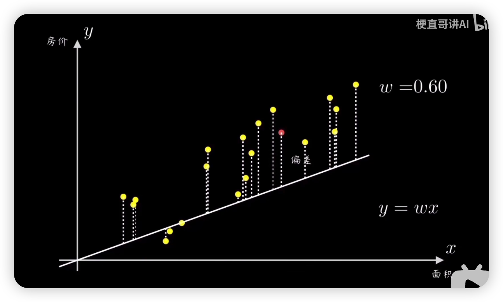
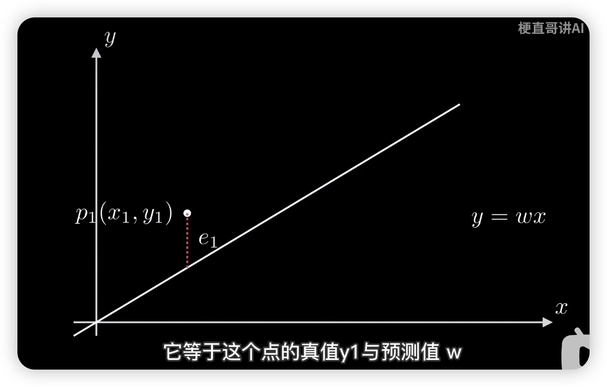
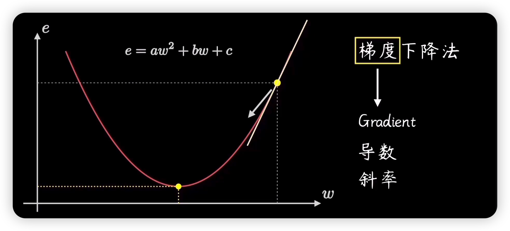
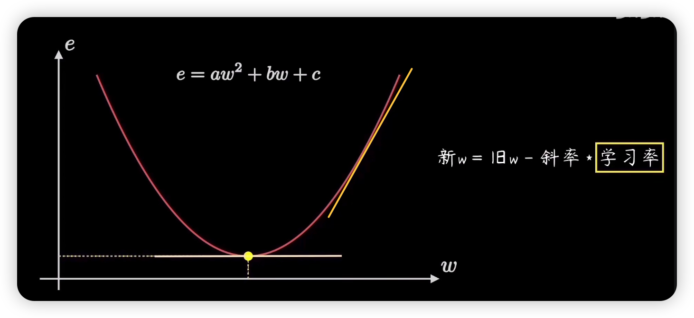
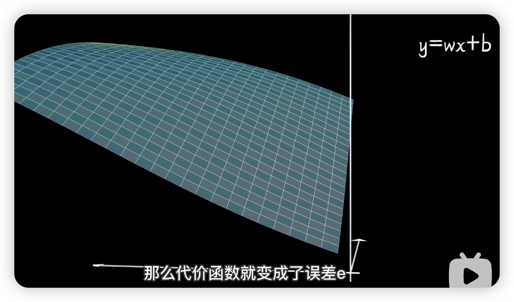
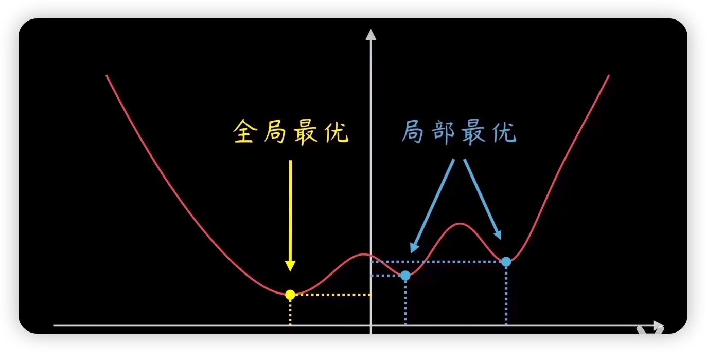
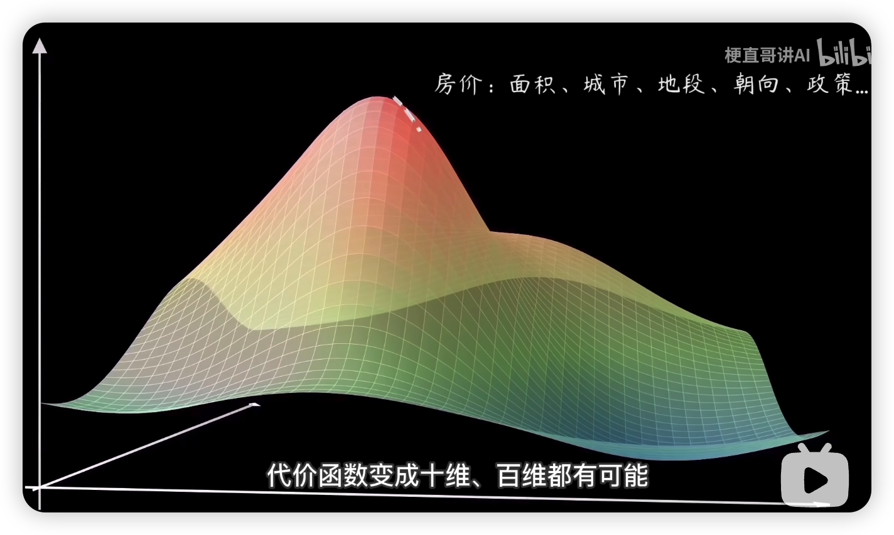
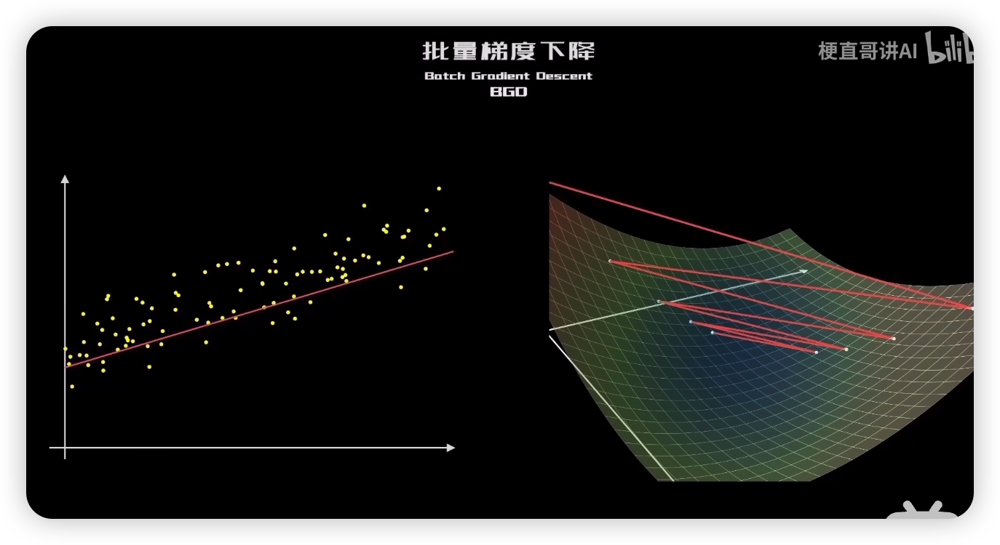
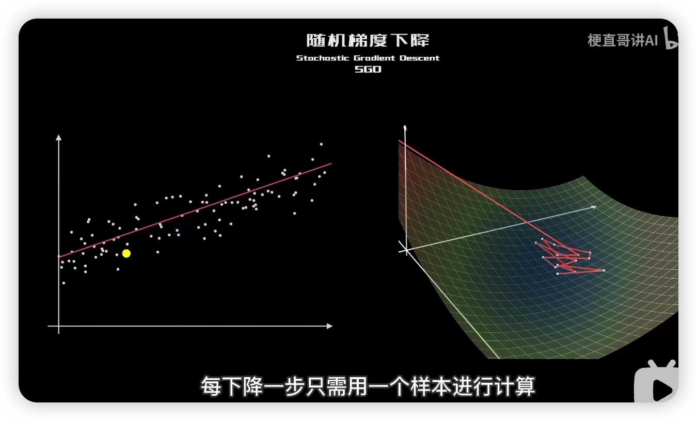
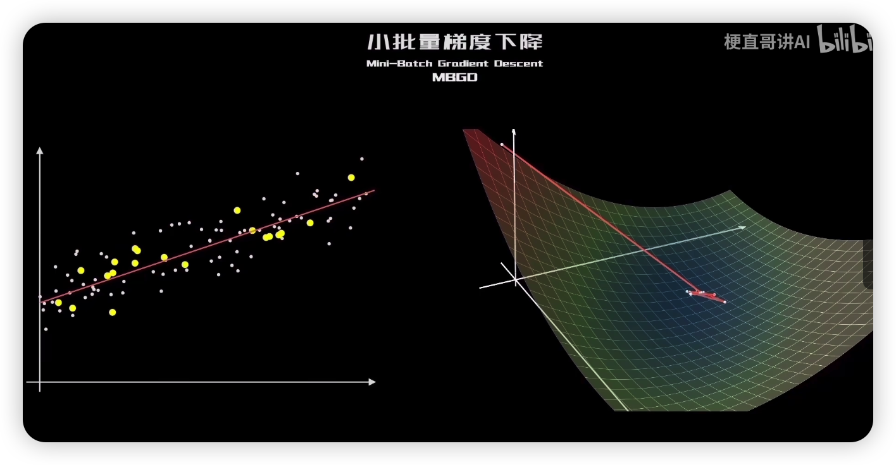

# 梯度

## 梯度的介绍

梯度是微积分中的一个重要概念，它描述了一个向量场在某一点的方向导数沿着该方向取得最大值，即函数在该点处沿着此方向（梯度的方向）变化最快，变化率最大（为梯度的模）。

简而言之，对多元函数的各个自变量求偏导数，并把求得的这些偏导数写成向量形式，就是梯度。
梯度的基本表达式是：
$\nabla f(x, y, z, ...) = 
\left(\frac{\partial f}{\partial x}, 
\frac{\partial f}{\partial y}, 
\frac{\partial f}{\partial z}, 
...
\right)$
其中，$\frac{\partial f}{\partial x}$、$\frac{\partial f}{\partial y}$、$\frac{\partial f}{\partial z}$ 等表示函数 $f$ 关于变量$x$、$y$、$z$的偏导数。

梯度通常用于机器学习和深度学习中的优化算法，如梯度下降法。

## 基本思想

梯度的基本思想是通过计算函数在给定点处的梯度来找到函数在该点处最陡峭上升的方向，从而确定函数在该点处的最佳搜索方向。**梯度是一个向量**，它的**方向是函数增长最快的方向**，而它的**模是函数在该方向上的增长速率**。

## 原理

梯度的原理是基于微积分中的偏导数。对于一个多变量函数 (f(x, y, z, ...))，其梯度是一个向量，包含所有偏导数。梯度的方向是函数增长最快的方向，而它的模是函数在该方向上的增长速率。

## 作用

梯度的作用主要有以下几点：

1. 梯度可以用于**优化问题**。例如，在机器学习中，我们经常需要最小化损失函数来训练模型。通过计算损失函数关于参数的梯度，我们可以使用梯度下降法等优化算法来更新参数，从而最小化损失函数。
2. 梯度可以帮助我们理解复杂函数的性质。例如，通过计算一个复杂函数的梯度，我们可以了解该函数在不同位置的变化情况。

## 梯度下降算法

### 基本思路

...

### 主要原理

1. 确定小目标（预测函数）

   _机器学习常见的任务是通过学习算法，自动发现数据背后的规律不断改进模型并做出预测。_

   基本方法：

   1. 找一个过原点的直线$y = wx$，即预测函数
   2. 然后计算所有样本点与直线的偏离程度
   3. 根据误差大小来调整斜率$w$
   4. 找到差距（代价函数）
      

      

   量化数据的偏离程度，即误差（常见的量化方式有：均方误差【误差平方和的平均值】）

- 得到误差函数，它代表了学习所需要付出的代价，故常被称为代价函数

通过定义预测函数，然后根据误差公式推导代价函数，成功将样本点拟合过程映射到了函数

3. 明确搜索方向（梯度计算）

   

4. 大胆的往前走吗？（学习率）

   

5. 不达目的不罢休（循环迭代）

   循环计算梯度和按学习率前进这两步，直到找到最低点。

### 没这么简单

在实际工作中，训练样本千奇百怪，代价函数千变万化，不太可能是简单的抛物线
如：

### 梯度下降法的各种变体

#### Batch Gradient Descent(BGD)

特点：全部训练样本参与训练
优点：保证算法精确度，找到全局最优点
缺点：计算速度慢

#### Stochastic Gradient Descent(SGD)

特点：每下降一步只需一个样本参与计算
优点：速度快
缺点：精准度较差

#### MBGD

特点：每下降一步只需一批次样本参与计算
优点：速度较快的同时保证了一定的精准度

#### 其他更优的算法：

- Adagrad 动态调节学习率：不常更新的学习率增大，频繁更新的学习率降低
  - 问题是：频繁跟新的学习率过小，以致逐渐消失
- RMSProp 优化动态调节学习率：解决 Adagrad 不足之处
- AdaDelta：无需设置学习率
- Adam：融合 AdaGrad 和 RMSProp
- Momentum：模拟动量
  - 下降过程中，充分考虑前一阶段下降的惯性
- FTRL……

### 梯度下降算法并非完美无缺

- 对于学习率的设定十分敏感；太大会反复横跳，太小会浪费计算力
- 除 BGD 外，无法保证找到全局最低点，可能会陷入局部低点难以自拔
