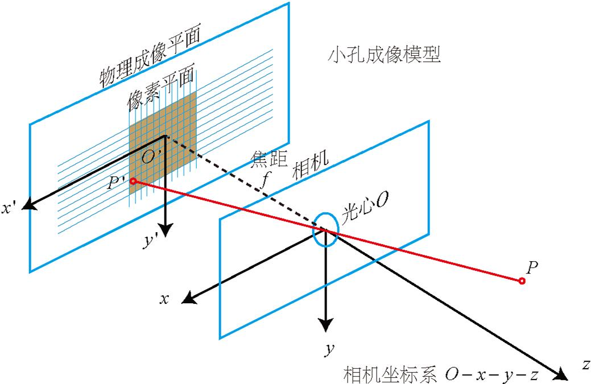
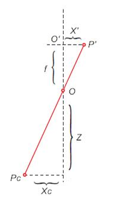

# 相机成像

相机成像是一个将三维世界中的物体投影到二维平面的过程，涉及的主要坐标系有世界坐标系、相机坐标系、图像坐标系和像素坐标系。

## 坐标系介绍

### 世界坐标系 Pw(Xw, Yw, Zw)

一个用于表示空间物体的绝对坐标系的三维直角坐标系，其原点位置可以根据实际情况自由确定。在这个坐标系中，任何物体的位置都可以使用 (X,Y,Z) 来表示其坐标值。

### 相机坐标系 PO(x, y, z)

一个以相机光心为原点的三维直角坐标系。其中，X 轴和 Y 轴分别与图像坐标系的 X 轴和 Y 轴平行，Z 轴则是相机的光轴。

### 图像坐标系 P’(x’, y’)

一个三维直角坐标系，但其原点在 CCD 图像平面的中心。在这个坐标系中，x 轴和 y 轴分别平行于像素坐标系的 u 轴和 v 轴。

### 像素坐标系 P(u, v)

一个用于表示图像中每个像素点在图像平面上的位置的二维直角坐标系。在这个坐标系中，每个像素点的位置可以使用 (u,v) 来表示。

> 图像坐标系与像素坐标系的关系图
>  > 
>
> 其中，u,v 是像素坐标轴；x,y 是图像坐标轴

## 坐标系转换

### 世界坐标系到相机坐标系

??? note "欧氏变换"

    欧氏变换，也被称为欧式变换或刚性变换，是一种可以在欧氏空间中进行的变换，它可以欧氏变换，也被称为欧式变换或刚性变换，是一种可以在欧氏空间中进行的变换，它可以保持欧氏空间中两点的距离和线段的相对长度不变。这种变换包括旋转变换、平移变换以及反射变换。

    在任何的三维空间的物体，都可以以三维坐标系表示，也即在现实空间中的物体的点，在不同的坐标系下的坐标是不一样的，因为基底不同，那么一个固定的点，在一个坐标系下的坐标，如果转换到另一个坐标系下，使得另外一个坐标系能够确定这个位置，就需要用到欧式变换。 任何一个坐标系到另一个坐标系的转换可以通过旋转和平移完成。

??? note "齐次坐标"

世界坐标系到相机坐标系的变换中也不例外的存在旋转矩阵 R 和平移矩阵 t，关系表示为：

$$
\begin{aligned}
\begin{bmatrix}
X_{c} \\
Y_{c} \\
Z_{c} \\
1
\end{bmatrix}
=
\begin{bmatrix}
R & t \\
0^T & 1
\end{bmatrix}
\begin{bmatrix}
X \\
Y \\
Z \\
1
\end{bmatrix}
=
L_W
\begin{bmatrix}
X \\
Y \\
Z \\
1
\end{bmatrix}
\end{aligned}
$$

### 相机坐标系到图像坐标系

原理：相似三角形

公式：

$$
Z_c *
\begin{bmatrix}
x \\
y \\
1
\end{bmatrix}
=
\begin{bmatrix}
f & 0 & 0 \\
0 & f & 0 \\
0 & 0 & 1
\end{bmatrix}
\begin{bmatrix}
X_c \\
Y_c \\
Z_c
\end{bmatrix}
$$

其中，f 表示相机的焦距。

???+ note "相似三角形"

    公式：

    $$
    \begin{cases}
    X' = f \frac{X_c}{Z_c} \\
    Y' = f \frac{Y_c}{Z_c}
    \end{cases}
    $$

    

### 图像坐标系到像素坐标系

??? note "像素坐标计算"

    公式：

    $$
    \begin{cases}
    u = \frac{x}{dx}+u_0 \\
    v = \frac{y}{dy}+v_0
    \end{cases}
    $$

    其中，dx 和 dy 分别表示图像坐标系 x 轴和 y 轴的像素间隔。

    齐次坐标下：

    $$
    \begin{bmatrix}
    u \\
    v \\
    1
    \end{bmatrix}
    =
    \begin{bmatrix}
    \frac{1}{dx} & 0 & u_0 \\
    0 & \frac{1}{dy} & v_0 \\
    0 & 0 & 1
    \end{bmatrix}
    \begin{bmatrix}
    x \\
    y \\
    1
    \end{bmatrix}
    $$

### 世界坐标系到图像像素坐标系

根据上面三种转换可得：

$$
\begin{aligned}
Z_c *
\begin{bmatrix}
u \\
v \\
1
\end{bmatrix}
& =
\begin{bmatrix}
\frac{1}{dx} & 0 & u_0 \\
0 & \frac{1}{dy} & v_0 \\
0 & 0 & 1
\end{bmatrix}
\begin{bmatrix}
f & 0 & 0 & 0 \\
0 & f & 0 & 0 \\
0 & 0 & 1 & 0
\end{bmatrix}
\begin{bmatrix}
R & t \\
0_{1 \times 3} & 1
\end{bmatrix}
\begin{bmatrix}
X_W \\
Y_W \\
Z_W \\
1
\end{bmatrix} \\
& =
\begin{bmatrix}
f_x & 0 & u_0 & 0 \\
0 & f_y & v_0 & 0 \\
0 & 0 & 1 & 0
\end{bmatrix}
\begin{bmatrix}
R & t \\
0_{1 \times 3} & 1
\end{bmatrix}
\begin{bmatrix}
X_W \\
Y_W \\
Z_W \\
1
\end{bmatrix}
\end{aligned}
$$

???+ note "相机内参矩阵："

    $$
    \begin{bmatrix}
    f_x & 0 & u_0 & 0 \\
    0 & f_y & v_0 & 0 \\
    0 & 0 & 1 & 0
    \end{bmatrix}
    $$

    其中：

    - $f_x$ 为焦距，单位为 mm；
    - $u_0$ 为图像坐标系原点在图像坐标系 x 轴的投影，单位为像素；
    - $v_0$ 为图像坐标系原点在图像坐标系 y 轴的投影，单位为像素。

???+ note "相机外参矩阵："

    $$
    \begin{bmatrix}
    R & t \\
    0_{1 \times 3} & 1
    \end{bmatrix}
    $$

    其中：

    - $R$ 为相机旋转矩阵，单位为弧度；
    - $t$ 为相机平移向量，单位为 mm。

> 相机标定就是为了求解此两个矩阵的参数。

## 总结

现实坐标转为图像像素的原理主要基于相机成像过程。现实世界中的物体首先通过相机镜头投影到成像平面（即 CCD 图像传感器）上，形成一个倒立的实像。然后，这个实像再经过成像器件（例如电荷耦合器件 CCD）转换为电子信号，并输出为数字图像。在这个过程中，物体在世界坐标系中的位置和姿态信息被转换为图像像素在像素坐标系中的位置信息。

---

参考资料：

- [图像处理——4 个坐标系及相关转换图像像素坐标系 图像物理坐标系 相机坐标系 世界坐标系](https://blog.csdn.net/MengYa_Dream/article/details/120233806)
- [CV 学习笔记-相机模型（欧式变换及仿射变换）](https://blog.csdn.net/qq_38853759/article/details/121354238)
- [世界坐标系、相机坐标系、图像坐标系、像素坐标系之间的转换](https://blog.csdn.net/lyhbkz/article/details/82254069)
  $$
