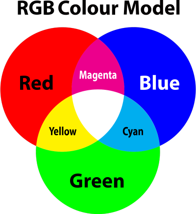
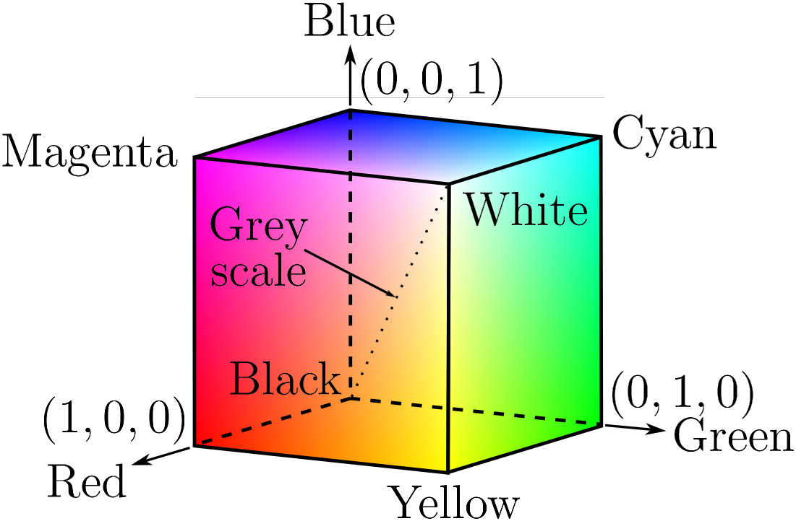
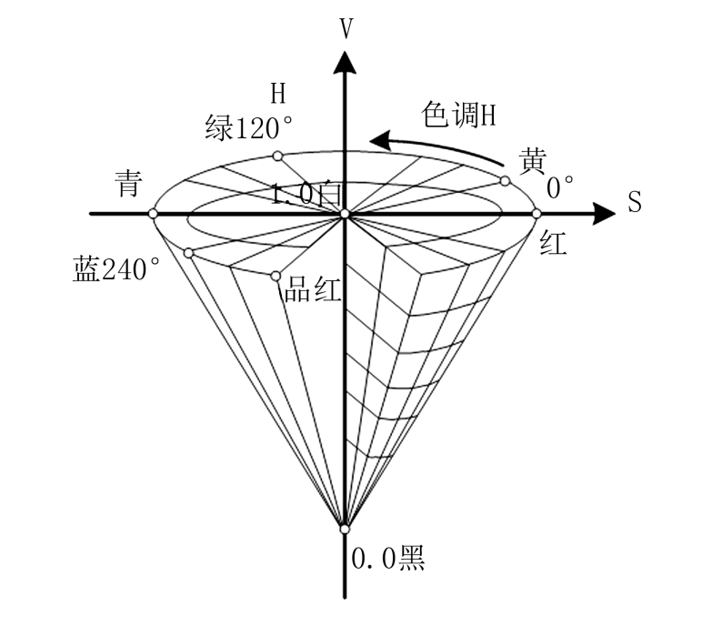
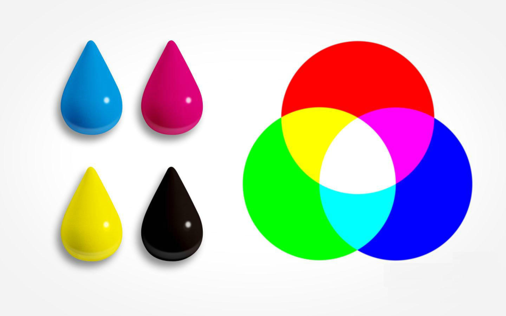

# 彩色图像

## 颜色模型

接下来，我们将探讨颜色模型的概念。颜色模型是用来描述颜色的一种方式，常见的颜色模型有`RGB`、`HSV`、`CMYK`等，它们用于在不同的环境和应用中表示和处理颜色。

=== "RGB"

    RGB 模型是面向硬件的加色模型，通过红绿蓝三种原色的叠加来显示不同的颜色。这种模型通常用于电子设备如电视和计算机屏幕等的颜色显示。
    

    RGB 颜色模型是三位直角坐标颜色系统汇总的一个单位正方体：

    

    - 主对角线上，各原色量相等，产生由暗到亮的白色，即灰度

=== "HSV"

    HSV 模型，也称六角锥体模型，是根据颜色的直观特性由 A. R. Smith 在 1978 年创建的面向用户的颜色空间。它非常直观地表达颜色的色调（Hue）、鲜艳程度（Saturation）和明暗程度（Value），因此在图像处理中使用较多，方便进行颜色的对比。

    

=== "CMYK"

    CMYK 模型与 RGB 正好相反，是面向印刷设备的颜色减色模型，通过青色（Cyan）、品红（Magenta）、黄色（Yellow）和黑色（Key）四种墨水的混合来生成各种颜色。

    

### 颜色模型总结

虽然这些颜色模型在理论上可以涵盖人类视觉系统可以感知的所有颜色，但它们在实际应用中的表现可能会因设备的不同而有所差异。因此，选择哪种颜色模型取决于特定的应用需求和设备特性。
其中，`RGB`颜色模型是最常用的一种，它使用三个参数(红、绿、蓝)来描述颜色。
灰度、通道和对比度也是图像处理中的重要概念，它们可以帮助我们更好地理解和处理图像。

## 灰度、通道和对比度

### 灰度

灰度是指一种颜色的明暗程度，它不包括色相。在数字图像处理中，灰度通常被用来表示黑白照片或黑白图像的明暗程度。在 RGB 模式中，如果一个像素的 RGB 数值相等，那么这个像素就会呈现出灰色。由于灰度不包含色相，所以它通常被用来表示颜色以外的其他信息，比如图像的通道。
范围一般为 0-255，白色为 255，黑色为。

### 通道

通道是数字图像处理中的一个概念，用于描述图像的颜色信息。例如，一张彩色图片就有三个通道：红色、绿色和蓝色通道。每个通道都存储着对应颜色的信息。

按数量分类（把图像分解成一个或多个颜色成分）：

1. 单通道：一个像素点只需一个数值表示，只能表示灰度，0 为黑色； (二值图&灰度图)
2. 三通道：`RGB`模式，把图像分为红绿蓝三个通道，可以表示彩色，全 0 表示黑色；
3. 四通道：`RGBA`模式，在 RGB 基础上加上 alpha 通道，表示透明度，alpha=0 表示全透明

### 对比度

对比度则是一幅图像中明暗区域最亮的白和最暗的黑之间不同亮度层级的测量。换句话说，**对比度就是最大亮度与最小亮度之比。**对比度越大，不同颜色之间的反差就越大，图像就越清晰；反之，对比度越小，不同颜色之间的反差就越小，图像就会显得模糊。

在数字图像处理中，对比度通常被定义为：
**对比度 = (亮度最大值 - 亮度最小值) / (亮度最大值 + 亮度最小值)**
其中，亮度最大值和亮度最小值分别表示图像中所有像素的亮度的最大值和最小值。

这个定义考虑了整个图像的亮度分布情况，更能准确地反映图像的对比度。

### 通道转换

#### RGB 转 Gray

将 RGB 图像转换为灰度图像是数字图像处理中常见的需求，常用的转换方法主要有两种。

???+ note "计算方式"

    首先，最常用的方法是通过加权平均的方式将 RGB 图像转换为灰度图像。计算公式如下：$gray = 0.2989 * R + 0.5870 * G + 0.1140 * B$，其中，gray 表示灰度值，R、G、B 分别代表 RGB 三个通道的像素值。这是最基本的转换方法，实现简单，应用广泛。

    其他计算方式：

    - 整数方法：$gray = (30R + 59G + 11B)/100$
    - 移位方法：$gray = (76R + 151G + 28B)>>8$
    - 平均值法：$gray = (R + G + B)/3$
    - 仅取绿色法：$gray = G$

#### RGB 值转浮点数

浮点数运算结果更精确，整数运算中会因丢弃小数部分可能导致颜色值严重失真，计算过程越多越失。
将 RGB 值转化为[0,1]浮点数 计算方式：$x/255$

#### RGB 值二值化处理

接下来，我们将学习如何将 RGB 图像转换为浮点数，并进行二值化处理。这个过程需要一些计算机编程的知识，但只要你熟悉 Python 或 Java 等编程语言，就能够轻松完成这个任务。

```python
if (img_gray[i, j] <= 0.5):
    img_gray[i, j] = 0
else:
    img_gray[i, j] = 1
```
