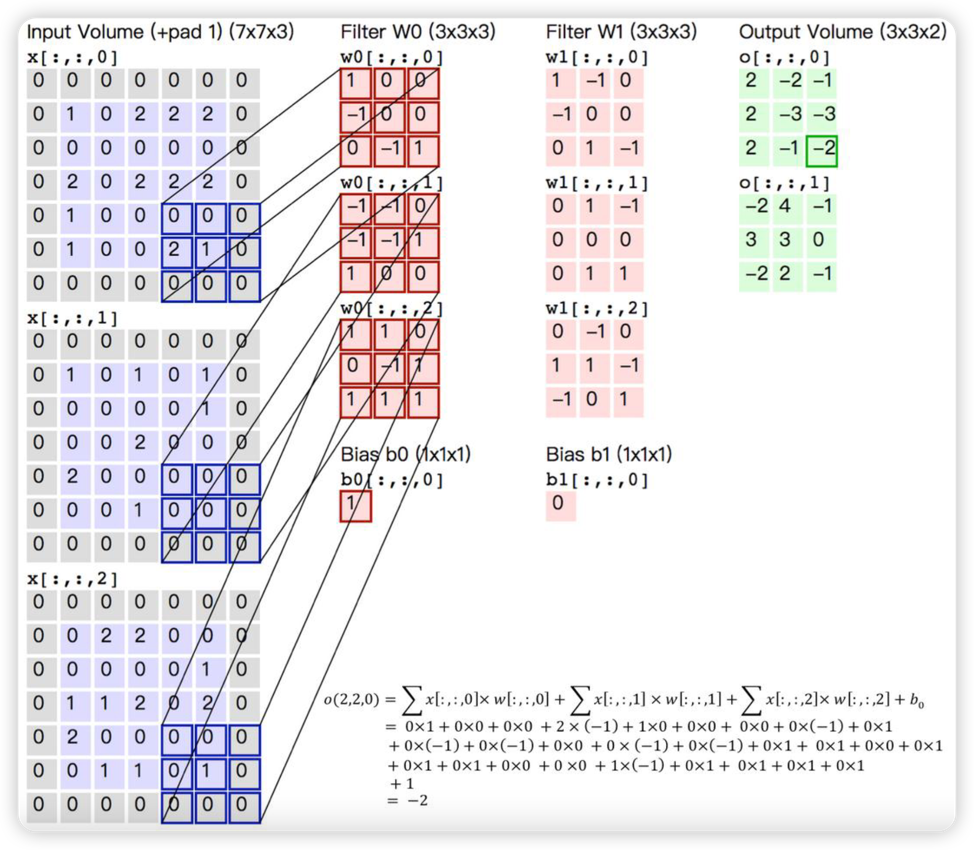

# 卷积

卷积（Convolution）是一种在图像处理中经常使用的操作。

卷积的主要作用是通过一个矩阵（也称卷积核）对图像进行卷积操作，得到一个新的图像。

> 
>
> No picture you say a J8!

## 数学中的卷积

<!-- todo -->

假装有内容……

## 卷积定义

数学定义：

$$
(f * g)(t) = \int_R f(x)g(t-x)dx
$$

一般称$g$为作用在$f$上的核，$f$为作用在图像上的函数，$t$为图像上的一个点，$x$为$t$点到$f$的距离。

## 图像卷积操作

> 图像频率知识回顾
>
> 图像的频率可以理解为图像中灰度级或颜色的变化频率。更具体来说，如果考虑图像上某一行像素，可以将之视为一个定义在一维空间上的信号，这个信号的频率就描述了图像上这个点的位置灰度（对于彩色图像则是 RGB 三个分量）的变化情况。例如，<u>当一幅图像中物体的边缘、纹理等灰度变化剧烈的地方，频率就会相应较高；反之，如果物体的某部分灰度变化较为缓慢，频率则相对较低。</u>因此，**频率可以反映图像中不同区域的灰度变化情况**。

卷积操作是通过对图像进行卷积操作，得到一个新的图像。卷积操作是一种在图像处理中经常使用的操作。卷积操作的一般步骤是：

1. 定义卷积核
2. 卷积核对图像进行卷积操作
3. 得到卷积结果

## 卷积核

卷积核是用来对图像进行卷积操作的矩阵。

其大小一般是奇数，比如 3x3，5x5 等。卷积核的作用类似于滤波器，它可以用来对图像进行模糊处理，去除噪声，提高图像的清晰度。

对于卷积核有但不限于下面这些规则要求：

1. 卷积核大小应该是奇数，这样才会有中心，有中心就有半径。（5\*5 的卷积核，中心是(3,3)，半径是 2）
2. 卷积核矩阵所有元素的和为 1，即所有元素的和为 1，这样可以保证卷积结果与原始图像的亮度是相同的（一般来说，在图像处理领域基本不用保证此规则，因为卷积一般都会有多层，多层卷积结果会叠加，所以亮度不一定相同）
3. 对于卷积后的结构，可能会出现负数或大于 255 的情况，需要直接截断到 0-255 之间

> 在卷积操作后，图像的结构为什么可能会出现负数或大于 255 的数值？
>
> 例如，当对全黑的图片进行卷积，而卷积核权值之和大于 0 时，就会出现负值。此外，一些特殊的滤波器，如边缘滤波器，其权值可能为负，这也可能导致卷积结果为负。
>
> 对于这些超出范围的数值，通常可以采取两种处理策略：
>
> 1. 将它们直接截断到 0 和 255 之间；
> 2. 对负数取绝对值。
>    这两种方法都能有效防止图像过度变暗或过亮，保证图像的明亮度和色彩平衡。

## 卷积核的类型

### 无效滤波

将原像素中间像素值乘 1，其余全为 0，显然像素值不会发生任何变化。

> 无效滤波(Identity Kernel)

$$
\begin{bmatrix}
0 & 0 & 0 \\
0 & 1 & 0 \\
0 & 0 & 0
\end{bmatrix}
$$

### 平滑均值滤波

如卷积核的大小为 3\*3，则取九个值的平均值代替中间像素值。

### 高斯平滑

高斯平滑水平和垂直方向呈现高斯分布，更突出了中心点在像素平滑后的权重，相比于均值滤波，高斯平滑更加平滑。

### 图像锐化

图像锐化使用的是拉普拉斯变换核函数：

$$
\begin{bmatrix}
0 & -1 & 0 \\
-1 & 5 & -1 \\
0 & -1 & 0
\end{bmatrix}
$$

$$
\begin{bmatrix}
-1 & -1 & -1 \\
-1 & 9 & -1 \\
-1 & -1 & -1
\end{bmatrix}
$$

### Soble 边缘检测

Soble 更强调了和边缘相邻的像素点对于边缘的影响。

> 水平梯度卷积核(Horizontal Gradient Convolution Kernel)

$$
\begin{bmatrix}
-1 & 0 & 1 \\
-2 & 0 & 2 \\
-1 & 0 & 1
\end{bmatrix}
$$

> 垂直梯度卷积核(Vertical Gradient Convolution Kernel)

$$
\begin{bmatrix}
-1 & -2 & -1 \\
0 & 0 & 0 \\
1 & 2 & 1
\end{bmatrix}
$$

## 步长

步长是卷积核移动的步长，步长越大，卷积核移动的距离越远，卷积核的作用就越强。

如果用$(f,f)$的过滤器来卷积一张$(h,w)$大小的图片，每次移动一个像素的话，那么得出的结果就是$(h-f+1,w-f+1)$的图片。

如果步长为$s$，那么结果就是

$$
(\lfloor\frac{h-f}{s}\rfloor+1,\lfloor\frac{w-f}{s}\rfloor+1)
$$

存在的问题：

- 只要是$f$或$s$的值大于 1，那么每次卷积之后的结果都会减小。

## 填充(padding)

有了填充后，每次卷积之后的图像大小变化有此规律：

$$
\begin{aligned}
h' &= \lfloor\frac{h+2p-f}{s}\rfloor+1 \\
w' &= \lfloor\frac{w+2p-f}{s}\rfloor+1
\end{aligned}
$$

如果想让图像的宽高卷积前后保持不变，那么$p$有：

$$
p = \frac{s(h-1)-h+f}{2}
$$

假设步长 s 为 1，那么填充的大小为：

$$
p = \frac{f-1}{2}
$$

### 填充方式

#### full

full 填充方式，从 filter 和 image 刚开始的地方开始填充，直到填充完整个图像。


#### same

same 填充方式，从 filter 中心(k)和 image 的边角重合时开始卷积，直到卷积完整个图像。


#### valid

valid 填充方式，从 filter 全部在 image 里面时开始卷积，直到卷积完整个图像。


## 多通道卷积



## 卷积核的选择

卷积核的选择是非常重要的，因为卷积核的大小决定了卷积操作的强度。

具体应用中，往往有多个卷积核，可以认为每个卷积核代表了一种图像模式，如果某个图像块与卷积核的卷积值大，则认为图像块十分接近此卷积核。

如：如果设计了 5 个卷积核，可以理解：我们认为这个图像上有 5 种底层纹理模式，也就是用 5 种基础模式就能描绘出一幅图像。

> CNN 厉害的地方在于：过滤器的特征并不需要人为设计，而是通过神经网络自动学习的。

## 卷积的应用

### 图像去噪

基于滤波器的方法和基于形态学的方法等都是常用的去噪方式。

其中，基于滤波器的方法包括中值滤波和维纳滤波等，它们利用某些人工设计的低通滤波器来去除图像噪声。例如，中值滤波器是一种非线性平滑滤波器，其基本原理是用图像中一个领域的各点值的中值替换该点的像素值，从而消除孤立的噪声点，对滤除图像的椒盐噪声非常有效。自适应维纳滤波器则能根据图像的局部方差来调整滤波器的输出，局部方差越大，滤波器的平滑作用越强。

此外，基于形态学的方法如开运算和闭运算等也可以用来去除图像噪声。

另一种现代方法是利用卷积神经网络进行去噪，如卷积盲去噪网络（CBDNet）就是一个结合噪声估计和非盲去噪模型的盲去噪方法。它通过依赖信号依赖噪声和相机图像信号处理对噪声的影响，将合成噪声与真实噪声图像一起用于网络训练，能够在真实噪声图像上实现良好的去噪效果和泛化能力。

### 图像模糊

卷积实现图像模糊的原理是利用卷积核与图像进行卷积操作，将卷积核中的每个像素值与对应位置的像素值相乘并求和，得到新的像素值。

常用的方式包括线性平滑滤波器、高斯滤波器、中值滤波器等。

其中，线性平滑滤波器是将卷积核中的所有像素值都设为相同的值，对整张图像进行加权平均；高斯滤波器则是将卷积核中的每个像素值按照高斯分布函数进行加权，使得图像的边缘更加平滑；中值滤波器则是将卷积核中的每个像素值替换为邻域内所有像素值的中位数，可以有效地去除椒盐噪声。

### 图像锐化

图像锐化的基本方法主要靠边界的差异增强，这要求对差异进行增强处理，通常使用微分运算来实现。在微分运算的基础上，可以采用梯度锐化和边缘检测。具体来说，图像锐化处理的目的是为了使图像的边缘、轮廓线以及图像的细节变得清晰。

经过平滑的图像变得模糊的根本原因是因为图像受到了平均或积分运算，因此可以对其进行逆运算（如微分运算）就可以使图像变得清晰。

卷积操作是实现图像锐化的一种常用方式。它的基本思想是将一个滤波器（也称为卷积核或模板）应用于图像的每个像素，通过对邻域像素的加权平均来改变中心像素的值。例如，在 OpenCV 中，我们可以使用卷积操作并调整拉普拉斯算子的参数来实现不同程度的图像锐化。此外，常用的卷积核包括 Sobel 算子、Prewitt 算子、Laplacian 算子等，它们都有助于突出图像的边缘和细节信息，从而实现图像锐化的效果。

## 常见滤波示例

### 中值滤波

```python
import cv2
import numpy as np

# 读取图像
image = cv2.imread('input.jpg', cv2.IMREAD_GRAYSCALE)

# 应用中值滤波器
denoised_image = cv2.medianBlur(image, ksize=3)

# 保存去噪后的图像
cv2.imwrite('output.jpg', denoised_image)
```

### 平滑均值滤波

```python
import cv2
import numpy as np

# 读取图像
image = cv2.imread('input.jpg')

# 定义平滑均值滤波器的大小
kernel_size = (5, 5)

# 应用平滑均值滤波
smoothed_image = cv2.blur(image, kernel_size)

# 显示原始图像和平滑后的图像
cv2.imshow('Original Image', image)
cv2.imshow('Smoothed Image', smoothed_image)

# 等待按键并关闭窗口
cv2.waitKey(0)
cv2.destroyAllWindows()
```

### 高斯模糊

```python
import cv2
import numpy as np

# 定义高斯滤波函数，用于模糊图像
def gaussian_blur(image, kernel_size):
    # 使用cv2.GaussianBlur函数，使用高斯滤波器，模糊图像
    return cv2.GaussianBlur(image, (kernel_size, kernel_size), 0)
# 读取图像
image = cv2.imread('/Users/kobe/Downloads/l_hires.jpg')
# 使用高斯滤波函数，模糊图像
blurred = gaussian_blur(image, 5)
# 将锐化后的图像保存
cv2.imwrite('/Users/kobe/Desktop/l_hires_blurred.jpg', blurred)
```

### 高斯锐化

此示例使用的卷积核是
$
\begin{bmatrix}
    -1 & -1 & -1 \\
    -1 & 9 & -1 \\
    -1 & -1 & -1
\end{bmatrix}
$
，对于此卷积核的主要功能就是**增强图像的边缘和细节**。图像的边缘通常变化较大，也就是图像的高频部分，因此这个锐化卷积核实际上是一种高通滤波器。

一个 3x3 的锐化卷积核对应位置像素与周围像素的差值进行计算，如果差值越大就表示该元素附近的变化越大（频率越大），输出值也就越大。因此，这是一种高频滤波器。此外，锐化卷积核的元素总和如果是 0，则有提取图像边缘信息的效果。

具体来说，当我们将此卷积核应用于图像时，它会对图像中的高频部分（如边缘和细节）进行增强，从而使图像更加清晰并具有更好的视觉效果。所以这就是为什么这个特殊的卷积核能有图像锐化的功能。

```python
import cv2
import numpy as np

# 定义锐化函数，用于锐化模糊的图像
def sharpen(image):
    # 定义锐化滤波器
    kernel = np.array([[-1,-1,-1], [-1,9,-1], [-1,-1,-1]])
    # 使用cv2.filter2D函数，使用锐化滤波器，锐化模糊的图像
    return cv2.filter2D(image, -1, kernel)
# 读取图像
image = cv2.imread('/Users/kobe/Downloads/l_hires.jpg')
# 使用锐化函数，锐化模糊的图像
sharpened = sharpen(image)
# 将锐化后的图像保存
cv2.imwrite('/Users/kobe/Desktop/l_hires_sharpened.jpg', sharpened)
```

### Soble 边缘检测

<!-- todo -->

```python
import cv2
import numpy as np
import matplotlib.pyplot as plt

# 读取图像
image = cv2.imread('input.jpg', cv2.IMREAD_GRAYSCALE)

# 使用Sobel算子进行边缘检测
sobel_x = cv2.Sobel(image, cv2.CV_64F, 1, 0, ksize=3)
sobel_y = cv2.Sobel(image, cv2.CV_64F, 0, 1, ksize=3)

# 计算梯度幅值和方向
gradient_magnitude = np.sqrt(sobel_x**2 + sobel_y**2)
gradient_direction = np.arctan2(sobel_y, sobel_x) * (180 / np.pi)

# matplotlib显示结果
plt.figure()
plt.subplot(1, 3, 1)
plt.imshow(image, cmap='gray')
plt.title('Original Image')

plt.subplot(1, 3, 2)
plt.imshow(gradient_magnitude, cmap='gray')
plt.title('Gradient Magnitude')

plt.subplot(1, 3, 3)
plt.imshow(gradient_direction, cmap='gray')
plt.title('Gradient Direction')

plt.show()
```

## 卷积的优势

卷积操作在图像处理和深度学习领域中有许多优点。首先，它可以自动学习图像中的特征，这些特征相比手动设计的特征更加精确和强大。其次，当处理大型图像数据集时，卷积神经网络能够获得更好的精度和效率。此外，卷积神经网络在处理图像中的平移不变性时非常有效，这使得它们在处理视觉问题时特别有用。

另外，卷积层是深度神经网络的重要组成部分，它的一个重要优点是局部连接，即保留了二维图像的相邻信息，避免了把二维图像的 raw data 直接摊平为一维数据输入深度神经网络。这种特性使得卷积神经网络可以更好地处理图像等数据，因为图像等数据具有空间连续性的特点。因此，通过使用卷积运算，我们可以有效地提取出图像中的特征信息。
