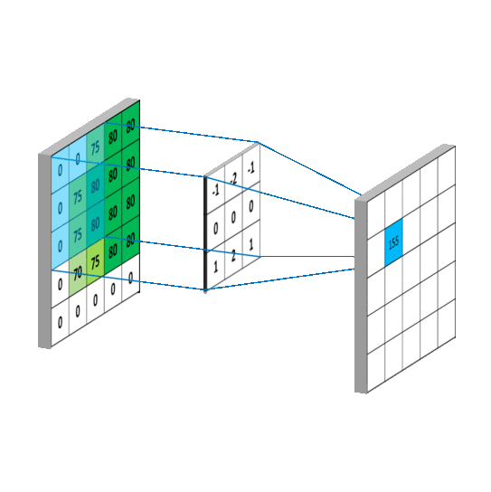
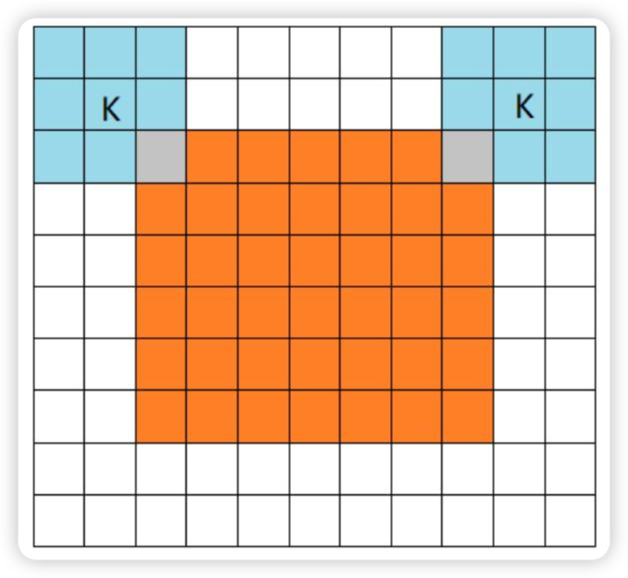
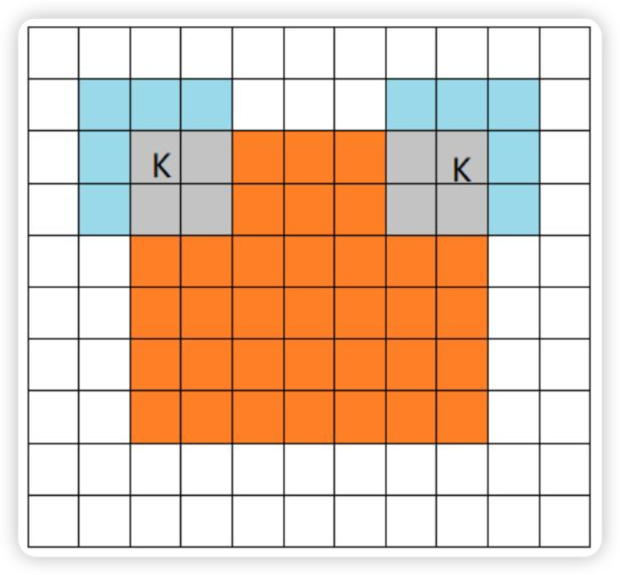
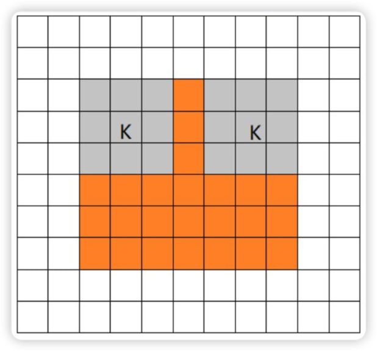
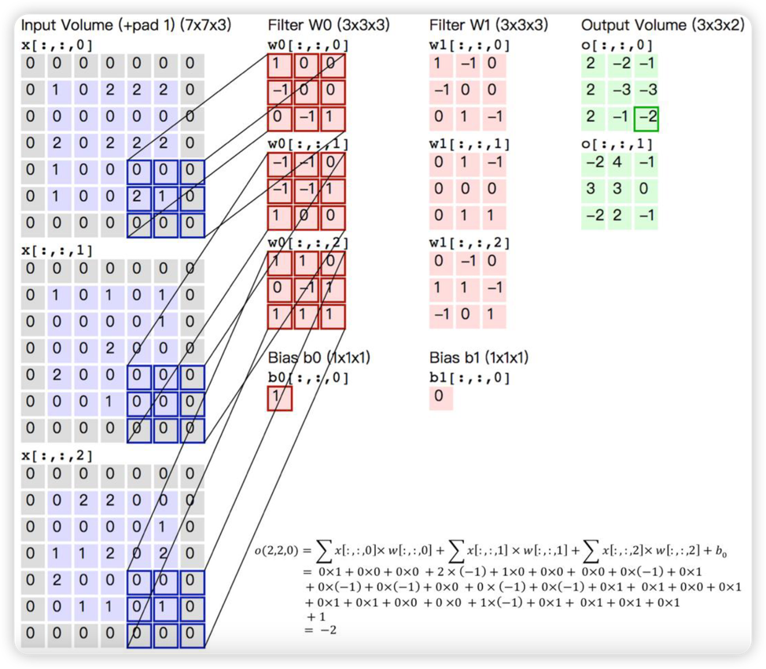
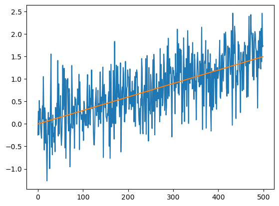
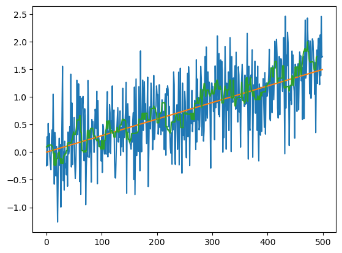
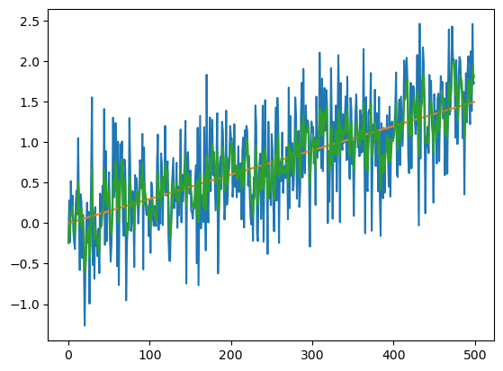

## 卷积

卷积（Convolution）是一种在图像处理中经常使用的操作。

卷积的主要作用是通过一个矩阵（也称卷积核）对图像进行卷积操作，得到一个新的图像。

> 

### 数学中的卷积

数学定义：

$$
(f * g)(t) = \int_R f(x)g(t-x)dx
$$

一般称$g$为作用在$f$上的核，$f$为作用在图像上的函数，$t$为图像上的一个点，$x$为$t$点到$f$的距离。

### 图像卷积步骤

卷积操作是通过对图像进行卷积操作，得到一个新的图像。卷积操作是一种在图像处理中经常使用的操作。卷积操作的一般步骤是：

1. 定义卷积核
2. 卷积核对图像进行卷积操作
3. 得到卷积结果

### 卷积核

卷积核是卷积神经网络中的核心组成部分，其主要功能是对输入数据进行特征提取。在具体类型上，卷积核可以是任何形状和大小的矩阵，常见的有 1x1、3x3 和 5x5 的尺寸。对于 1D 卷积核，它通常是一维矩阵；对于 2D 卷积核，它就是一个二维矩阵；对于 3D 卷积核，则是一个三维矩阵。

需要特别注意的是，`kernel`和`filter`这两个术语经常被混为一谈。实际上，`kernel` 就是权重矩阵，用于与输入相乘以提取相关特征。而 `filter` 是由多个 `kernel` 的串联组成，每个 `kernel` 负责处理输入的特定通道。因此，在卷积操作中，通常使用的是 `filter` 而不是 kernel。

!!! tip "卷积核主要规则要求"

    1. 卷积核大小应该是奇数，这样才会有中心，有中心就有半径。（5\*5 的卷积核，中心是(3,3)，半径是 2）
    2. 卷积核矩阵所有元素的和为 1，即所有元素的和为 1，这样可以保证卷积结果与原始图像的亮度是相同的（一般来说，在图像处理领域基本不用保证此规则，因为卷积一般都会有多层，多层卷积结果会叠加，所以亮度不一定相同）
    3. 对于卷积后的结构，可能会出现负数或大于 255 的情况，需要直接截断到 0-255 之间

??? question "在卷积操作后，图像的结构为什么可能会出现负数或大于 255 的数值？"

    当对全黑的图片进行卷积，而卷积核权值之和大于 0 时，就会出现负值。此外，一些特殊的滤波器，如边缘滤波器，其权值可能为负，这也可能导致卷积结果为负。

??? success "卷积后图像的处理策略"

    对于这些超出范围的数值，通常可以采取两种处理策略：

    1. 将它们直接截断到 0 和 255 之间；
    2. 对负数取绝对值。

    这两种方法都能有效防止图像过度变暗或过亮，保证图像的明亮度和色彩平衡。

### 步长(Stride)

步长是卷积核移动的步长，步长越大，卷积核移动的距离越远，卷积核的作用就越强。

如果用$(f,f)$的过滤器来卷积一张$(h,w)$大小的图片，每次移动一个像素的话，那么得出的结果就是$(h-f+1,w-f+1)$的图片。

如果步长为$s$，那么结果就是$(\lfloor\frac{h-f}{s}\rfloor+1,\lfloor\frac{w-f}{s}\rfloor+1)$

!!! tip

    只要是$f$或$s$的值大于 1，那么每次卷积之后的结果都会减小。

### 填充(Padding)

有了填充后，每次卷积之后的图像大小变化有此规律：

$$
\begin{aligned}
h' &= \lfloor\frac{h+2p-f}{s}\rfloor+1 \\
w' &= \lfloor\frac{w+2p-f}{s}\rfloor+1
\end{aligned}
$$

如果想让图像的宽高卷积前后保持不变，那么$p$有：

$$
p = \frac{s(h-1)-h+f}{2}
$$

假设步长 s 为 1，那么填充的大小为：

$$
p = \frac{f-1}{2}
$$

???+ note "填充方式"

    === "full"

        full 填充方式，从 filter 和 image 刚开始的地方开始填充，直到填充完整个图像。

        

    === "same"

        same 填充方式，从 filter 中心(k)和 image 的边角重合时开始卷积，直到卷积完整个图像。

        

    === "valid"

        valid 填充方式，从 filter 全部在 image 里面时开始卷积，直到卷积完整个图像。

        

### 多通道卷积



### 卷积核的选择

卷积核的选择是非常重要的，因为卷积核的大小决定了卷积操作的强度。

具体应用中，往往有多个卷积核，可以认为每个卷积核代表了一种图像模式，如果某个图像块与卷积核的卷积值大，则认为图像块十分接近此卷积核。

如：如果设计了 5 个卷积核，可以理解：我们认为这个图像上有 5 种底层纹理模式，也就是用 5 种基础模式就能描绘出一幅图像。

> CNN 厉害的地方在于：过滤器的特征并不需要人为设计，而是通过神经网络自动学习的。

### 卷积的应用

???+ info "图像去噪"

    基于滤波器的方法和基于形态学的方法等都是常用的去噪方式。

    其中，基于滤波器的方法包括中值滤波和维纳滤波等，它们利用某些人工设计的低通滤波器来去除图像噪声。例如，中值滤波器是一种非线性平滑滤波器，其基本原理是用图像中一个领域的各点值的中值替换该点的像素值，从而消除孤立的噪声点，对滤除图像的椒盐噪声非常有效。自适应维纳滤波器则能根据图像的局部方差来调整滤波器的输出，局部方差越大，滤波器的平滑作用越强。

    此外，基于形态学的方法如开运算和闭运算等也可以用来去除图像噪声。

    另一种现代方法是利用卷积神经网络进行去噪，如卷积盲去噪网络（CBDNet）就是一个结合噪声估计和非盲去噪模型的盲去噪方法。它通过依赖信号依赖噪声和相机图像信号处理对噪声的影响，将合成噪声与真实噪声图像一起用于网络训练，能够在真实噪声图像上实现良好的去噪效果和泛化能力。

???+ info "图像模糊"

    卷积实现图像模糊的原理是利用卷积核与图像进行卷积操作，将卷积核中的每个像素值与对应位置的像素值相乘并求和，得到新的像素值。

    常用的方式包括线性平滑滤波器、高斯滤波器、中值滤波器等。

    其中，线性平滑滤波器是将卷积核中的所有像素值都设为相同的值，对整张图像进行加权平均；高斯滤波器则是将卷积核中的每个像素值按照高斯分布函数进行加权，使得图像的边缘更加平滑；中值滤波器则是将卷积核中的每个像素值替换为邻域内所有像素值的中位数，可以有效地去除椒盐噪声。

???+ info "图像锐化"

    图像锐化的基本方法主要靠边界的差异增强，这要求对差异进行增强处理，通常使用微分运算来实现。在微分运算的基础上，可以采用梯度锐化和边缘检测。具体来说，图像锐化处理的目的是为了使图像的边缘、轮廓线以及图像的细节变得清晰。

    经过平滑的图像变得模糊的根本原因是因为图像受到了平均或积分运算，因此可以对其进行逆运算（如微分运算）就可以使图像变得清晰。

    卷积操作是实现图像锐化的一种常用方式。它的基本思想是将一个滤波器（也称为卷积核或模板）应用于图像的每个像素，通过对邻域像素的加权平均来改变中心像素的值。例如，在 OpenCV 中，我们可以使用卷积操作并调整拉普拉斯算子的参数来实现不同程度的图像锐化。此外，常用的卷积核包括 Sobel 算子、Prewitt 算子、Laplacian 算子等，它们都有助于突出图像的边缘和细节信息，从而实现图像锐化的效果。

### 卷积的优势

卷积操作在图像处理和深度学习领域中有许多优点。首先，它可以自动学习图像中的特征，这些特征相比手动设计的特征更加精确和强大。其次，当处理大型图像数据集时，卷积神经网络能够获得更好的精度和效率。此外，卷积神经网络在处理图像中的平移不变性时非常有效，这使得它们在处理视觉问题时特别有用。

另外，卷积层是深度神经网络的重要组成部分，它的一个重要优点是局部连接，即保留了二维图像的相邻信息，避免了把二维图像的 raw data 直接摊平为一维数据输入深度神经网络。这种特性使得卷积神经网络可以更好地处理图像等数据，因为图像等数据具有空间连续性的特点。因此，通过使用卷积运算，我们可以有效地提取出图像中的特征信息。

## 滤波

滤波是图像处理中的一个重要的技术，它可以用来消除图像中的噪声，提高图像的清晰度，增强图像的对比度，提高图像的分辨率等。

### 卷积和滤波的区别

滤波和卷积都是图像处理中常用的操作，它们在原理上具有一定的相似性。然而在实现细节上，二者存在一些区别。滤波操作是图像对应像素与掩膜（mask）的对应元素相乘相加。而卷积操作则是将一个卷积核（也称为掩膜）在图像上滑动，计算卷积核与滑动窗口内的图像像素的乘积之和。

虽然滤波和卷积操作有所区别，但两者也有紧密的联系。具体来说，图像的线性滤波就是通过卷积操作来完成的。此外，卷积核可以看作是一种特殊的滤波器，只不过它是用来对图像进行特征提取的，也就是说，卷积核是由学习得到的权重参数构成的。因此，滤波和卷积常常被同时应用在图像处理和深度学习等领域中。

### 图像滤波实践

简单的滤波算法效果有限，只能处理线性数据；且每个滤波算法都有自己的局限，针对于不通的问题需要选择合适的方法：

```python title="测试数据"
import random
import math
import numpy as np
import matplotlib.pyplot as plt

n = 500
real = [] # 真值
mear = [] # 观测值
pred = [] # 滤波值

# 建立真值和观测值
for i in range(n):
  num = 0.003 * i
  real.append(num)
  num += 0.1 * np.random.standard_normal()  # 本身的不确定性
  num += 0.5 * np.random.standard_normal()  # 观测的不确定性
  mear.append(num)

plt.plot(range(n), mear)
plt.plot(range(n), real)
plt.show()
```



### 滤波分类

图像滤波分为以下几种：

1. 均值滤波
2. 中值滤波
3. 一阶($\alpha \beta$)滤波
4. 卡尔曼滤波
5. 高斯滤波
6. 双边滤波
7. 锐化滤波
8. 边缘检测

#### 无效滤波(Identity Kernel)

将原像素中间像素值乘 1，其余全为 0，显然像素值不会发生任何变化。

$$
\begin{bmatrix}
0 & 0 & 0 \\
0 & 1 & 0 \\
0 & 0 & 0
\end{bmatrix}
$$

#### 平滑均值滤波

如卷积核的大小为 3\*3，则取九个值的平均值代替中间像素值。

```python title="平滑均值滤波"
import cv2
import numpy as np

# 读取图像
image = cv2.imread('input.jpg')

# 定义平滑均值滤波器的大小
kernel_size = (5, 5)

# 应用平滑均值滤波
smoothed_image = cv2.blur(image, kernel_size)

# 显示原始图像和平滑后的图像
cv2.imshow('Original Image', image)
cv2.imshow('Smoothed Image', smoothed_image)

# 等待按键并关闭窗口
cv2.waitKey(0)
cv2.destroyAllWindows()
```

#### 均值滤波

均值滤波是典型的线性滤波算法，在图像中应用比较多，原理是以该像素点周围的八个像素点取平均操作，然后替代该像素点，也就是卷积操作。

对于处理简单的线性数据 y=ax+b，原理也是类似的，取该点周围的 n 个点取平均即可，n 可以看为是一个滑窗。因此，可以取该点的前后 n 个数据的平均值，也可以取前 n 个数据的平均值，根据不同场景数据设计即可。

如下代码比较适合离线数据处理，是对原始观测的数据中取某点的前后滑窗大小的均值，好比图像中应用中就是对原始图片滤波。如果对于在线数据，一个不断增加数据的数组，建议使用一阶滤波器或者 kalman 滤波器。

```python
# window滑窗越大，滤波效果越明显，结果越滞后
# 设置了该点的左右滑窗大小，可根据实际情况选取参数
def average_filter(window_left, window_right, arr):
  size = len(arr)
  result = []
  for i in range(window_left, size-window_right):
    sum = 0
    # 滑窗
    for j in range(-window_left, window_right+1):
      sum += arr[i+j]
    sum /= (window_left + window_right + 1)
    result.append(sum)
  return result

pred = [] # 滤波值
# 前后5个，总共11个点求平均值
pred = average_filter(5, 5, mear)

# 前5个数，总共6个点求平均值
# pred = average_filter(5, 0, mear)


plt.plot(range(n), mear)
plt.plot(range(n), real)
# 会牺牲掉前后window大小的数据，可以作相应改进
plt.plot(range(len(pred)), pred)
print(len(pred))
```


#### 中值滤波

和均值滤波相似，同样是选取固定大小滑窗，然后选取滑窗内的中位数作为滤波结果。或者选取中位数平均数，类似比赛中去掉最高最低分，对其余比分求平均，这种可以叫做中位值平均滤波法。思路都是差不多的，都是需要做一遍排序。

中值滤波能有效克服偶然因素引起的波动噪声。

中值滤波对椒盐噪声（椒盐噪声是指图像中出现了白点或者黑点，可能是光亮的亮点或者暗的暗点）非常有效。

```python
# window滑窗越大，滤波效果越明显，结果越滞后
# 设置了该点的左右滑窗大小，可根据实际情况选取参数
def Median_Filter(window_left, window_right, arr):
  size = len(arr)
  result = []
  for i in range(window_left, size-window_right):
    # 滑窗
    temp = []
    for j in range(-window_left, window_right+1):
      temp.append(arr[i+j])
    temp.sort()
    point = temp[(int)(len(temp)/2)]
    result.append(point)
  return result

# 中值平均值滤波
def MedianAvg_Filter(window_left, window_right, arr):
  size = len(arr)
  result = []
  for i in range(window_left, size-window_right):
    # 滑窗
    temp = []
    for j in range(-window_left, window_right+1):
      temp.append(arr[i+j])
    temp.sort()
    # 可以去掉最大值后，取中位数的平均值
    median_mean = []
    for m in range(1, len(temp)-1):
      median_mean.append(temp[m])

    result.append(np.mean(median_mean))
  return result

pred = [] # 滤波值
# 前后5个，总共11个点求中值
pred = Median_Filter(5, 5, mear)
# pred = MedianAvg_Filter(5, 5, mear)

# 前5个数，总共6个点求中值
# pred = Median_filter(5, 0, mear)


plt.plot(range(n), mear)
plt.plot(range(n), real)
# 会牺牲掉前后window大小的数据，可以作相应改进
plt.plot(range(len(pred)), pred)
```



#### 一阶$\alpha \beta$滤波

一阶滤波是比较常用简单的滤波方法，就是当前采样结果和上一个滤波结果加权求和，权重和为 1。对周期干扰噪声有良好的抑制作用，但同样会产生相位滞后，权重是固定值也是其缺点之一。

```python
# a值越小，越不相信观测，滤波效果越明显，结果越滞后
def ab_filter(a, now):
  global last
  return a * now + (1 - a) * last

pred = []
last = mear[0]
pred.append(last)

for i in range(1, n):
  last = ab_filter(0.4, mear[i])
  pred.append(last)

plt.plot(range(n), mear)
plt.plot(range(n), real)
plt.plot(range(n), pred)
```



#### 卡尔曼滤波

???+ note "卡尔曼滤波算法原理(KF,EKF,AKF,UKF)"

    [卡尔曼滤波算法原理(KF,EKF,AKF,UKF)](https://blog.csdn.net/weixin_43152152/article/details/115753921)

```python
# 滤波效果主要调整参数：
# 过程噪声方差q(越小越相信预测，反之亦然)， 观测噪声方差r(越小越相信观测，反之亦然)
q, r = 0.1, 2
# 状态均值x， 过程噪声均值w，方差p
x, w, p = 0, 0, 0
def kalman_filter(z):
  global x, p
  # 预测
  x_ = x + w
  p_ = p + q
  k = p_ / (p_ + r)
  # 更新
  x = x_ + k * (z - x_)
  p = (1-k) * p_
  return x

pred = [] # 滤波值
for i in range(n):
  pred.append(kalman_filter(mear[i]))

plt.plot(range(n), mear)
plt.plot(range(n), real)
plt.plot(range(n), pred)
```


#### 高斯滤波

!!! tip

    高斯滤波包含许多种，包括低通、带通和高通等。

> 高斯模糊对于抑制**高斯噪声 (服从正态分布的噪声) **非常有效。

我们通常图像上说的高斯滤波(Gaussian filter)，指的是`高斯模糊(Gaussian Blur)` ，是一种高斯低通滤波，所以对图像进行"高斯模糊"后，图像会变得模糊。(1)
{.annotate}

1.  高斯滤波是一种线性平滑滤波，适用于消除高斯噪声，广泛应用于图像处理的减噪过程；

    通俗的讲，高斯滤波就是对整幅图像进行**加权平均**的过程，每一个像素点的值，都由其本身和邻域内的其他像素值经过加权平均后得到。

??? note "高斯高通与低通滤波"

    高斯高通滤波：高斯高通滤波器会锐化图像，原理是：保留图像高频成分（图像细节部分），过滤图像低频成分（图像平滑区域）

    高斯低通滤波：高斯低通滤波器会模糊图像，原理是：过滤图像高频成分（图像细节部分），保留图像低频成分（图像平滑区域）

高斯滤波的具体操作是：用一个模板（或称卷积、掩模）扫描图像中的每一个像素，用模板确定的邻域内像素的加权平均灰度值去替代模板中心像素点的值用。

??? note "高斯滤波的实现"

    在图像处理中，高斯滤波一般有两种实现方式，一是用__离散化窗口滑窗卷积__，另一种通过__傅里叶变换__。

    最常见的就是第一种滑窗实现，只有当离散化的窗口非常大，用滑窗计算量非常大（即使用可分离滤波器的实现）的情况下，可能会考虑基于傅里叶变化的实现方法。

    由于高斯函数可以写成可分离的形式，因此可以采用可分离滤波器[^1]实现来加速。

    高斯模糊是一个非常典型的图像卷积的例子，本质就是将（灰度）图像 I 核一个高斯核进行卷积操作：

    $$
    I_{\sigma}=I \otimes G_{\sigma}
    $$

    其中：$\otimes$表示卷积操作，$G_{\sigma}$是标准差为$\sigma$的二维高斯核，定义为：

    $$
    G_{\sigma}=
    \frac{1}{2\pi\sigma^2}
    e^{-\frac{x^2+y^2}{2\sigma^2}}
    $$

???+ note "高斯锐化"

    ```python title="高斯锐化"
    import cv2
    import numpy as np

    # 定义锐化函数，用于锐化模糊的图像
    def sharpen(image):
        # 定义锐化滤波器
        `kernel` = np.array([[-1,-1,-1], [-1,9,-1], [-1,-1,-1]])
        # 使用cv2.filter2D函数，使用锐化滤波器，锐化模糊的图像
        return cv2.filter2D(image, -1, kernel)
    # 读取图像
    image = cv2.imread('/Users/kobe/Downloads/l_hires.jpg')
    # 使用锐化函数，锐化模糊的图像
    sharpened = sharpen(image)
    # 将锐化后的图像保存
    cv2.imwrite('/Users/kobe/Desktop/l_hires_sharpened.jpg', sharpened)
    ```

    此示例使用的卷积核是$\begin{bmatrix}-1 & -1 & -1 \\-1 & 9 & -1 \\-1 & -1 & -1\end{bmatrix}$，对于此卷积核的主要功能就是**增强图像的边缘和细节**。图像的边缘通常变化较大，也就是图像的高频部分，因此这个锐化卷积核实际上是一种高通滤波器。

    !!! tip

        一个 3x3 的锐化卷积核对应位置像素与周围像素的差值进行计算，如果差值越大就表示该元素附近的变化越大（频率越大），输出值也就越大。因此，这是一种高频滤波器。此外，锐化卷积核的元素总和如果是 0，则有提取图像边缘信息的效果。

        具体来说，当我们将此卷积核应用于图像时，它会对图像中的高频部分（如边缘和细节）进行增强，从而使图像更加清晰并具有更好的视觉效果。所以这就是为什么这个特殊的卷积核能有图像锐化的功能。

#### 图像锐化

图像锐化使用的是拉普拉斯变换核函数：

$$
\begin{bmatrix}
0 & -1 & 0 \\
-1 & 5 & -1 \\
0 & -1 & 0
\end{bmatrix}
$$

$$
\begin{bmatrix}
-1 & -1 & -1 \\
-1 & 9 & -1 \\
-1 & -1 & -1
\end{bmatrix}
$$

### 总结

对于简单的线性数据处理完之后就可使用最小二乘法来拟合出一个比较好的结果；

因为各个滤波器取的参数不一，结果对比起来是没有意义的，而且采样点比较多，没有具体分析细节，建议应用时测试充分选取合适的方法。

[^1]: 可分离滤波器：是可以把多维的卷积化成多个一维卷积。具体到二维的高斯滤波，就是指先对行做一维卷积，再对列做一维卷积。这样就可以将计算复杂度从 $O(M^2*N^2)$降到 $O(2M^2N)$，M，N 分别是图像和滤波器的窗口大小。
