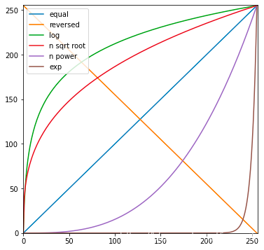
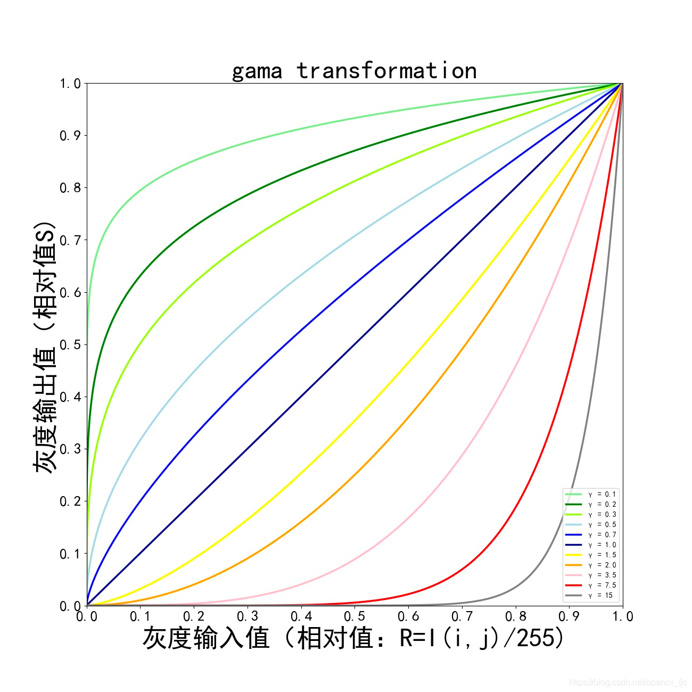

# 图像增强

图像增强，是有目的地强调图像的整体或局部特性，将原来不清晰的图像变得清晰或强调某些感兴趣的特征，扩大图像中不同物体特征之间的差别，抑制不感兴趣的特征，使之改善图像质量、丰富信息量，加强图像判读和识别效果，满足某些特殊分析的需要。

图像增强可以分为两种：

- 点处理技术：只对单个像素进行处理
- 领域处理技术：对像素点及其周围的点进行处理，即使用卷积核。

常用方法：

- 翻转、平移、旋转、缩放
- 分离单个 r、g、b 三个颜色通道
- 添加噪声
- 直方图均衡化
- Gamma 变换
- 反转图像的灰度
- 增加图像的对比度
- 缩放图像的灰度
- 均值滤波
- 中值滤波
- 高斯滤波

## 点处理

### 线性变换

图像增强线性变换主要对图像的对比度和亮度进行调整：
$$y=a*x+b$$
参数$a$影响图像的对比度，参数$b$影响图像的亮度，具体可分为以下几种情况：

- $a \gt 1$时：会增强图像的对比度，图像变清晰；反之则降低对比度，图像变模糊
- $a = 1 \ \ and \ \ b \neq 0$时：图像整体的灰度值上移或下移，也就是图像整体变亮或变暗，不会改变图像的对比度
- $b \gt 0$时：会增加亮度，图像变亮；反之则降低亮度，图像变暗

### 分段线性变换

即对处于某个感兴趣的区域 x，将其对比度系数 a 增大或减小，从而增大或减小这个区域的对比度。

$$
\begin{cases}
y=a_1*x+b
&  x \le x_1 \\
y=a_2*x+b
& x \le x \lt x_2 \\
y=a_1*x+b
& x_2 \le x
\end{cases}
$$

### 对数变换

对数变换将图像的低灰度值部分扩展，将其高灰度值部分压缩，以达到强调图像低灰度部分的目的；同时可以很好的压缩像素值变化较大的图像的动态范围，目的是突出我们需要的细节。
$$y=c*log(1+x)$$

### 幂律变换、伽马变换

用于图像的矫正，对漂白的图片或者是过黑的图片进行修正。
$$y=c*x^{\gamma}$$

根据$\gamma$的大小，主要可分为以下两种情况：

- $\gamma \gt 1$：处理漂白图片，进行灰度级压缩
- $\gamma \lt 1$：处理过黑图片，进行对比度增强，使得细节看的更加清楚
