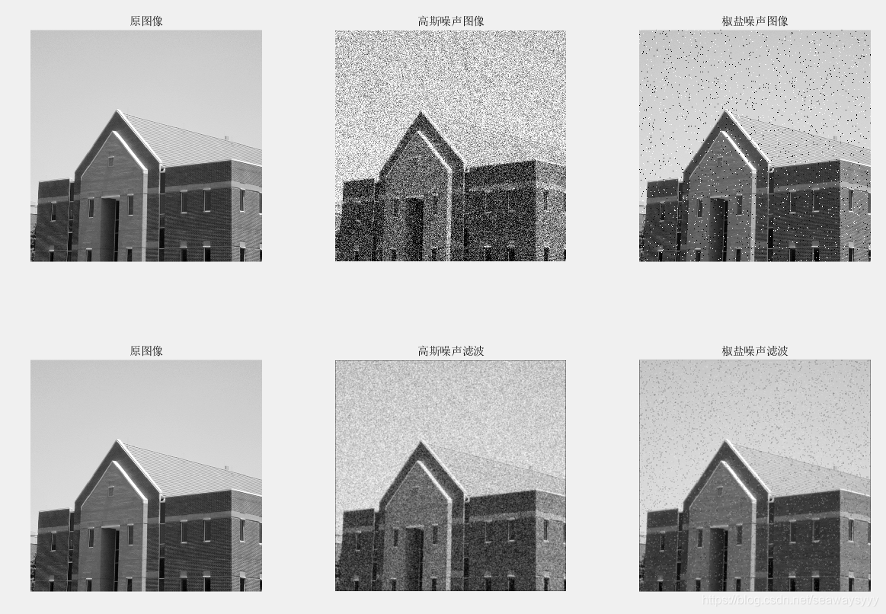
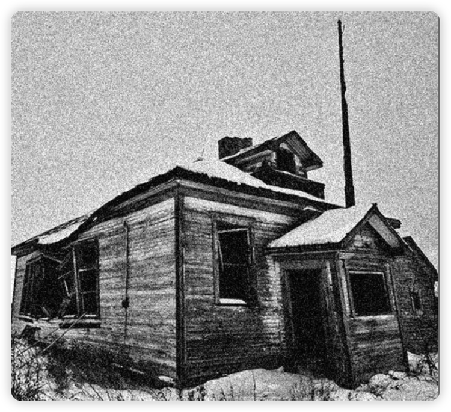
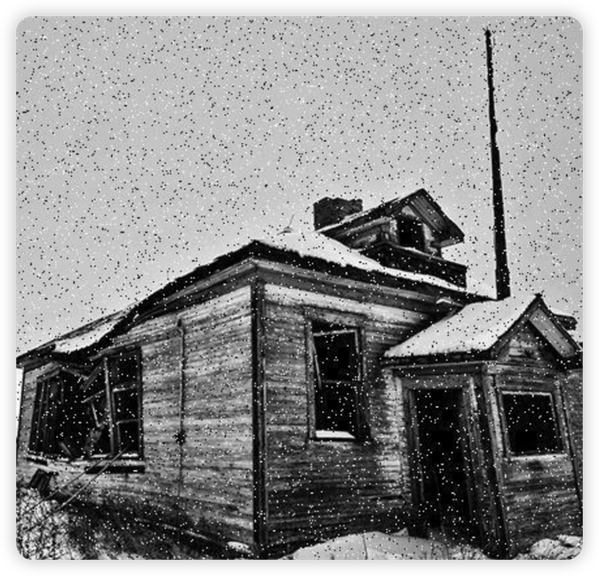

# 图像噪声

> No picture you say a J8
>
> 

图像噪声是图像在获取或是传输过程中受到随机信号干扰，妨碍人们对图像理解及分析处理的信号。

图像噪声的产生来自图像获取中的环境条件和传感元器件自身的质量，图像在传输过程中产生图像噪声的主要因素是所用的传输信道受到了噪声的污染。

## 高斯噪声

高斯噪声(Gaussian noise)是指它的概率密度函数服从高斯分布的一类噪声。
如果一个噪声，它的幅度分布服从高斯分布，而它的任意两个采样样本之间不相关，则称它为高斯白噪声。

### 产生原因

1. 图像传感器在拍摄时不够明亮、亮度不够均匀；
2. 电路各元器件自身噪声和相互影响；
3. 图像传感器长期工作，温度过高。

### 高斯采样分布

一个正常的高斯采样分布公式，得到输出像素 Pout.
$$Pout = Pin + random.gauss$$

其中 Pin 是输入像素， random.gauss 是通过 sigma 和 mean 来生成符合高斯分布的随机数。

给一副数字图像加上高斯噪声的处理顺序如下:

1. 输入参数 sigma 和 mean
2. 生成高斯随机数
3. 根据输入像素计算出输出像素
4. 重新将像素值放缩在[0 ~ 255]之间
5. 循环所有像素
6. 输出图像

## 白噪音

### 白噪音与高斯噪音

必须区分高斯噪声和白噪声两个不同的概念。
高斯噪声是指噪声的概率密度函数服从高斯分布， 白噪声是指噪声的任意两个采样样本之间不相关，两者描述的角度不同。
白噪声不必服从高斯分布，高斯分布的噪声不一定是白噪声。

链接：[高斯分布](https://zhuanlan.zhihu.com/p/158683846)

## 椒盐噪音

椒盐噪声又称为脉冲噪声，它是一种随机出现的白点或者黑点。
椒盐噪声 = 椒噪声 (pepper noise)+ 盐噪声(salt noise)。 椒盐噪声的值为 0(椒)或者 255(盐)。
前者是低灰度噪声，后者属于高灰度噪声。一般两种噪声同时出现，呈现在图像上就是黑白杂点。
对于彩色图像，也有可能表现为在单个像素 BGR 三个通道随机出现的 255 或 0。
如果通信时出错，部分像素的值在传输时丢失，就会发生这种噪声。
椒盐噪声的成因可能是影像讯号受到突如其来的强烈干扰而产生等。例如失效的感应器导致像素值为最小值，饱和的感应器导致像素值为最大值。

### 加噪步骤

给一副数字图像加上椒盐噪声的处理顺序:

1. 指定信噪比 SNR(信号和噪声所占比例) ，其取值范围在[0, 1]之间
2. 计算总像素数目 SP， 得到要加噪的像素数目 NP = SP \* SNR
3. 随机获取要加噪的每个像素位置 P(i, j)
4. 指定像素值为 255 或者 0
5. 重复 3, 4 两个步骤完成所有 NP 个像素的加噪

## 柏松噪声

符合柏松分布的噪声模型；
适合于描述单位时间内随机事件发生的次数的概率分布；比如：某一服务设施在一定时间内受到的服务请求的次数，电话交换机接到呼叫的次数、汽车展台的候客人数、机器出现的故障数、自然灾害发生的次数、DNA 序列的变异数、放射性原子核的衰变数等……

### 特点

1. 时间越长，事件发生的可能越大，且不通时间内发生该事件的概率是相互独立的
2. 对于非常短的一段时间来说，出现该时间两次的概率几乎为 0
3. 一开始的时候事件没有发生过

### 公式：

$$
P[(N(t+\gamma)-N(t))=k]=\frac{e^{-\lambda\gamma}(\lambda\gamma)^k}{k!}\ \ \ \ \ k=0,1,...
$$

## 乘性噪声

一般由信道不理想引起，他们与信号的关系是相乘，信号在它就在，信号无它就无。

### 瑞利噪声

相比高斯噪声而言，其形状向右歪斜，这对与拟合某些歪斜直方图噪声很有用。
瑞利噪声的实现可以借由平均噪声来实现。

## 伽马噪声

其分布服从了伽马曲线的分布。
伽马噪声的实现需要使用 b 个服从指数分布的噪声叠加而来。
指数分布的噪声，可以使用均匀分布来实现。（b=1 时为指数噪声，b>1 时通过若干个指数噪声叠加，得到伽马噪声）

---

参考链接：[MATLAB 详解高斯噪声、椒盐噪声，简单实现图像的均值滤波、中值滤波并分析其有效性](https://blog.csdn.net/seawaysyyy/article/details/102559457)
