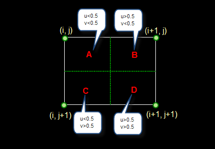
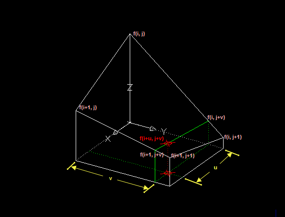
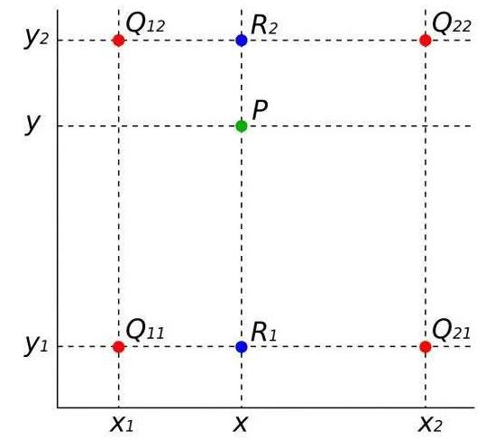
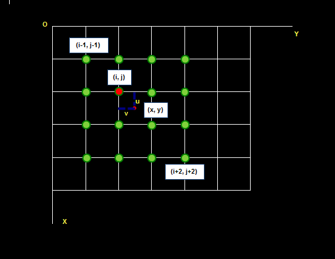

# 图像的取样和量化

取样和量化是图像处理中的重要步骤。这两个步骤可以帮助我们有效地减少计算复杂性，提高处理速度。

## 取样（数字化坐标值）

取样是指从图像中选择一部分区域进行处理
取样结果质量的高低就是用图像的分辨率来衡量的；

上下采样是一种常用的图像增强技术，它可以通过改变图像的空间分辨率来增加图像的细节和清晰度。这种方法通常用于数字图像处理和计算机视觉领域。

### 上采样（upsampling）

上采样，也被称为图像插值或放大图像，是一种将图像的尺寸扩大到更高分辨率的技术手段。这种操作的主要目的是生成我们所需要的尺寸，常用于特征融合[^1]。

???+ question "“牛眼”现象"

    在图像处理中，“牛眼”现象是一个关于插值算法的特殊问题。具体来说，它是某些偏大或偏小的数据在插值过程中形成的以插值点为圆心的圈状现象。

    此现象的出现主要归因于插值区域监测分布的不均匀性。在反距离加权插值（IDW）这种插值方法中，由于仅以距离为权重进行计算，忽略了方位等其他因素的影响，因此往往会导致插值结果与实际测量值之间存在较大的偏差。

    为了解决这个问题，需要改进插值算法或者优化数据处理的方法，以提高插值的准确性和效率。

> 原理：内插值

#### 常用方法

常用的上采样方法有：最邻近元法、双线性插值、双三次插值、反卷积和反池化等。

???+ note "最邻近元法"

    最邻近元法是最简单的一种上采样方法，不需要计算，只需要将待求像素点的周围最近的像素点的值赋给它即可。这种方法简单快速，但可能会导致图像模糊。

    > 原理：

    设$i+u, j+v(i, j为正整数， u, v为大于零小于1的小数，下同)$为待求像素坐标，则待求像素灰度的值 $f(i+u, j+v)$ 如下图所示：

    

    如果$(i+u, j+v)$落在 A 区，即$u<0.5, v<0.5$，则将左上角像素的灰度值赋给待求像素，同理，落在 B 区则赋予右上角的像素灰度值，落在 C 区则赋予左下角像素的灰度值，落在 D 区则赋予右下角像素的灰度值。

    最邻近元法计算量较小，但可能会造成插值生成的图像灰度上的不连续，在灰度变化的地方可能出现明显的锯齿状。

???+ note "双线性插值"

    双线性插值是一种**基于距离权重**的插值方法，它考虑了待求像素点周围四个方向上的像素值，根据距离进行加权平均，从而得到更精确的结果。这种方法可以有效地保留图像的细节信息，但计算量较大。

    ??? note "原理（原始版本）"

        双线性内插法是利用待求像素四个邻像素的灰度在两个方向上作线性内插，如下图所示：

        

        对于 $(i, j+v)，f(i, j) 到 f(i, j+1)$ 的灰度变化为线性关系，则有：
        $$f(i, j+v) = [f(i, j+1) – f(i, j)] * v + f(i, j)$$
        同理对于 $(i+1, j+v)$ 则有：
        $$f(i+1, j+v) = [f(i+1, j+1) – f(i+1, j)] * v + f(i+1, j)$$
        从 $f(i, j+v) 到 f(i+1, j+v)$ 的灰度变化也为线性关系，由此可推导出待求像素灰度的计算式如下：
        $$f(i+u, j+v) = (1-u) * (1-v) * f(i, j) + (1-u) * v * f(i, j+1) + u * (1-v) * f(i+1, j) + u * v * f(i+1, j+1)$$

    ??? note "原理（简化版本）"

        

        $f(P) = f(x,y)$；

        $f(R_1) = f(x,y_1)$，
        $f(R_2) = f(x,y_2)$；

        $f(Q_{11}) = f(x_1,y_1)$，
        $f(Q_{12}) = f(x_1,y_2)$，
        $f(Q_{21}) = f(x_2,y_1)$，
        $f(Q_{22}) = f(x_2,y_2)$

        在 x 方向做插值：

        $$
        f(R_1) = \frac{x_2-x}{x_2-x_1}f(Q_{11}) + \frac{x-x_1}{x_2-x_1}f(Q_{21})\\

        f(R_2) = \frac{x_2-x}{x_2-x_1}f(Q_{12}) + \frac{x-x_1}{x_2-x_1}f(Q_{22})
        $$

        在 y 方向做插值：

        $$
        f(P) = \frac{y_2-y}{y_2-y_1}f(R_1) + \frac{y-y_1}{y_2-y_1}f(R_2)
        $$

        有：

        $$
        \begin{align}
        f(p) &=
        \frac{y_2-y}{y_2-y_1}f(R_1)
        +
        \frac{y-y_1}{y_2-y_1}f(R_2) \\
        &=
        \frac{y_2-y}{y_2-y_1}
        \left[
        \frac{x_2-x}{x_2-x_1}f(Q_{11})
        +
        \frac{x-x_1}{x_2-x_1}f(Q_{21})
        \right]
        +
        \frac{y-y_1}{y_2-y_1}
        \left[
        \frac{x_2-x}{x_2-x_1}f(Q_{12})
        +
        \frac{x-x_1}{x_2-x_1}f(Q_{22})
        \right]
        \end{align}
        $$

        因为图像像素的灰度值是连续的，所以上式中 $x_2-x_1$,$y_2-y_1$ 均为 1

    双线性内插法的计算比最邻近点法复杂，计算量较大，但没有灰度不连续的缺点，结果基本令人满意。它具有低通滤波性质，使高频分量受损，图像轮廓可能会有一点模糊。

    ??? question "几何中心点重合证明"

        设：

        原图像 $M \times M$，目标图像 $N \times N$
        1. 目标图像在原图像坐标系的位置为 $(x, y)$
        2. 原图坐标$(x_m,y_m), m = 0,1,2,...,M-1$，几何中心 $(x_c,y_c), c=\frac{M-1}{2}$
        3. 目标图坐标 $(x_n,y_n), n = 0,1,2,...,N-1$, 几何中心 $(x_d,y_d), d=\frac{N-1}{2}$

        此时

        $$
        m = n \times \frac{M}{N}
        $$

        要使几何中心相同，那么必存在一个值$Z$，使得$\frac{M-1}{2}+Z  = (\frac{N-1}{2}+Z)\frac{M}{N}$;

        解：

        $$
        Z + \frac{M-1}{2} = \frac{(N-1)M}{2N} + \frac{ZM}{N}
        $$

        移项：

        $$
        Z - \frac{ZM}{N} = \frac{(N-1)M}{2N} - \frac{M-1}{2}
        $$

        化简：

        $$
        Z(1-\frac{M}{N}) = \frac{-M+N}{2N}
        $$

        化简：

        $$
        \begin{align}
        Z(\frac{N-M}{N}) &= \frac{N-M}{2N} \\
        &=\frac{1}{2}(\frac{N-M}{N})
        \end{align}
        $$

        有：$Z =\frac{1}{2}$

        所以：要使两个图像的几何中心点重合，则必须将目标图像的坐标和原图像的坐标同时加$\frac{1}{2}$

???+ note "双三次插值"

    双三次插值是一种更复杂的插值方法，它可以在不失真的情况下对图像进行放大，因此在图像处理中得到了广泛的应用。但是，由于其计算量大，所以在实际应用中需要权衡性能和精度。

    ??? note "原理"

        该方法利用三次多项式$S(x)$求逼近理论上最佳插值函数$sin(x)/x$, 其数学表达式为：
        $S(x) =
        \begin{cases}
        1-2\lvert x \rvert^2 + \lvert x \rvert^3 & 0 \le \lvert x \rvert \lt 1 \\
        4-8\lvert x \rvert + 5\lvert x \rvert^2 -\lvert x \rvert^3 & 1 \le \lvert x \rvert \lt 2 \\
        0 & \lvert x \rvert \le 2
        \end{cases}$
        待求像素(x, y)的灰度值由其周围 16 个灰度值加权内插得到，如下图：

        

        待求像素的灰度计算式如下：
        $f(x, y) = f(i+u, j+v) = ABC$
        其中:

        $$
        A=\begin{pmatrix}
        S(1+v)\\
        S(v)\\
        S(1-v)\\
        S(2-v)
        \end{pmatrix}^T
        $$

        $$
        B=\begin{pmatrix}
        f(i-1,j-1) & f(i-1,j) & f(i-1,j+1) & f(i-1,j+2)\\
        f(i,j-1) & f(i,j) & f(i,j+1) & f(i,j+2)\\
        f(i+1,j-1) & f(i+1,j) & f(i+1,j+1) & f(i+1,j+2)\\
        f(i+2,j-1) & f(i+2,j) & f(i+2,j+1) & f(i+2,j+2)\\
        \end{pmatrix}
        $$

        $$
        C=\begin{pmatrix}
        S(1+u)\\
        S(u)\\
        S(1-u)\\
        S(2-u)
        \end{pmatrix}
        $$

    三次曲线插值方法计算量较大，但插值后的图像效果最好。

#### 反卷积和反池化

反卷积和反池化则是深度学习中常用的上采样方法。反卷积操作可以通过学习卷积核来恢复图像的细节信息，从而实现图像的放大。反池化操作则是通过恢复池化操作丢失的信息来实现图像的放大。这两种方法都可以实现精确的上采样，但计算量较大。

### 下采样（subsampled）

下采样，也被称为降采样或缩小图像，其主要目的是减少数据的尺寸，使得图像符合显示区域的大小，生成对应图像的缩略图。
在数字信号处理领域，这是一种多速率数字信号处理的技术或是降低信号采样率的过程，通常用于降低数据传输速率或者数据大小。

???+ note "原理"

    下采样的原理主要是通过池化操作来实现的，常见的方法有**最大池化**和**平均池化**等。

    这些方法可以有效地降低特征图的尺寸，减少计算量，同时增大感受野，使得后面的卷积核能够学到更加全局的信息。

#### 常用方法

对于下采样，其常用的方法有**池化操作**，比如最大池化和平均池化等。
池化操作可以通过取平均值或者最大值等方式将一个大的像素块缩小到一个像素值，从而减少特征图的尺寸。

- 最大池化

  最大池化是将输入特征图的一个 s\*s 的窗口内的最大值作为输出像素值

- 平均池化

  平均池化则是将窗口内的平均值作为输出像素值。

- 方法总结

  下采样的目的是为了降低计算复杂度，同时增强特征的感受野，使得模型能够更好地处理目标的整体信息。

## 量化（数字化幅度值）

而量化则是将这部分区域的颜色或灰度值转化为一个数值表示。
量化是指使用多大范围的数值来表示图像采样后的一个点。

---

参考资料：

- [插值方法总结 - 元享技术](https://www.yuanxiangzhixin.com/21478.html)

[^1]: 特征融合：是指将两个或多个特征图融合成一个特征图的过程。特征融合可以提高图像分类的准确性和泛化能力。
