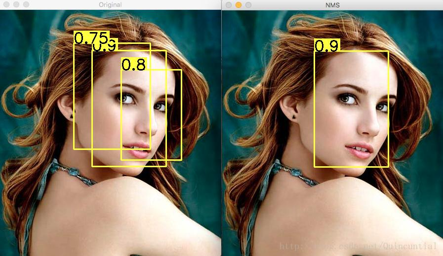
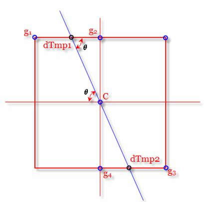

# 边缘提取

!!! question "边缘是什么？"

    边缘是图像中不同区域之间的边界线，通常一个边缘图像是一个二值图像。

## 边缘提取的目的

边缘检测的目的就是捕捉这些亮度急剧变化的区域，而这些区域通常是我们关注的。它是图像处理和计算机视觉中的基本问题，尤其是在特征提取领域，其目标是标识数字图像中亮度变化明显的点。

## 边缘提取的原理

边缘检测的原理主要是基于图像强度的突变（如灰度级的跳变），通过一阶导数或二阶导数来检测边缘。 (1) 大部分的边缘检测算法可以划分为两类：基于一阶导数和基于零穿越/零交叉的二阶导数。
{ .annotate }

1.  :如果在此边缘部分求取一阶导数，就会看到极值的出现；而在一阶导数为极值的地方，二阶导数为 0，基于这个原理，就可以进行边缘检测。

\*[零穿越/零交叉]:

    零穿越/零交叉是指在灰度级跳变的地方，一阶导数为 0，二阶导数为 0。

## 边缘提取算法

常见的边缘检测算法有 Prewitt 算子、Sobel 算子和 Canny 算子等。

Prewitt 算子是一种一阶导数的边缘算子，通过模板作为核与图像的每个像素点做卷积和运算，然后选取合适的阈值来提取图像的边缘。

Sobel 算子也是一种一阶导数的边缘算子，它通过计算图像的一阶导数来检测边缘。

Canny 算子则是一种非常优秀的边缘检测算法，它是基于梯度幅值和非极大值抑制的边缘检测方法。

!!! tip "知识回顾"

??? quote "梯度"

??? quote "卷积"

??? quote "高频信号与低频信号"

??? quote "图像平滑"

??? quote "图像锐化"

### Prewitt

Prewitt 算子是一种一阶微分算子的边缘检测，利用像素点上下、左右邻点的灰度差，在边缘处达到极值检测边缘，去掉部分伪边缘，对噪声具有平滑作用。

#### 原理

原理是在图像空间利用两个方向模板 (1) 与图像进行邻域卷积来完成的
{ .annotate }

1.  :这两个方向模板一个检测水平边缘，一个检测垂直边缘。

    - 检测水平边缘

      $$
      G_x =
      \begin{bmatrix}
      -1 & 0 & 1\\
      -1 & 0 & 1\\
      -1 & 0 & 1\\
      \end{bmatrix}
      $$

    - 检测垂直边缘

      $$
      G_y =
      \begin{bmatrix}
      -1 & -1 & -1\\
      0 & 0 & 0\\
      1 & 1 & 1\\
      \end{bmatrix}
      $$

#### 步骤

### Sobel

Sobel 算子是典型的基于一阶导数的边缘检测算子，由于该算子中引入了类似局部平均的运算，因此对噪声具有平滑作用，能很好的消除噪声的影响。 Sobel 算子对于像素的位置的影响做了加权，因此与 Prewitt 算子相比效果更好。

!!! note "Sobel 算子模版"

    Sobel 算子包含两组 3x3 的矩阵，分别为横向及纵向模板，将之与图像作平面卷积，即可分别得出横向及纵向的亮度差分近似值。实际使用中，常用如下两个模板来检测图像边缘:

    - 检测垂直边缘：

    $$
    G_x =
    \begin{bmatrix}
    -1 & 0 & 1 \\
    -2 & 0 & 2 \\
    -1 & 0 & 1
    \end{bmatrix}
    $$

    - 检测水平边缘：

    $$
    G_y = \begin{bmatrix}
    -1 & -2 & -1 \\
    0 & 0 & 0 \\
    1 & 2 & 1
    \end{bmatrix}
    $$

!!! failure "Sobel 算子的缺点"

    Sobel 算子对噪声比较敏感，在图像中加噪声时，Sobel 算子检测出来的边缘会不准确。

    Sobel算子并没有将图像的主题与背景严格地区分开来，换言之就是Sobel算子并没有基于图像灰度进行处理，由于Sobel算子并没有严格地模拟人的视觉生理特征，所以提取的图像轮廓有时并不能令人满意。

#### 原理

#### 步骤

### Canny

Canny 算法是一种被广泛应用于边缘检测的标准算法，由计算机科学家 John F. Canny 于 1986 年提出。它的主要目标是找到一个最优的边缘检测解或找寻一幅图像中灰度强度变化最强的位置。

Canny 算子是一种基于梯度的边缘检测算法，通过计算图像中像素点的梯度大小和方向来工作。(1)
{ .annotate }

1.  :具体来说，它首先使用高斯滤波器来去除图像中的噪声，然后计算图像的梯度强度和方向，最后通过非极大值抑制和双阈值处理来检测和强化边缘。

这种算法被认为是目前理论上最完善的一种边缘检测方法，因为它能够在抗噪声干扰和精确定位之间寻求最佳折中方案。Canny 算子的应用非常广泛，例如在物体识别领域，如机器人视觉等，都有大量的应用实例。

#### 原理

???+ note "高斯平滑"

    高斯平滑水平和垂直方向呈现高斯分布，更突出了中心点在像素平滑后的权重，相比于均值滤波而言，有着更好的平滑效果。

    $$
    G(x) = \frac{1}{\sqrt{2\pi} \sigma}e^{-\frac{x^2}{2\sigma^2}}
    $$

    $$
    G(x,y) = \frac{1}{2\pi\sigma^2}e^{-\frac{(x^2+y^2)}{2\sigma^2}}
    $$

    高斯卷积核大小会影响 Canny 检测器的性能：

    - 卷积核越大，检测器对噪声的敏感度越低，但边缘定位精度也越低。
    - 卷积核越小，检测器对噪声的敏感度越高，但边缘定位精度越高。

    一般情况下，卷积核大小为 5×5 比较合适。

    [高斯噪声](../chapter05_image_filter/image_noise.md#高斯噪声)

!!! Note "非极大值抑制"

    非极大值抑制（Non-Maximum Suppression，NMS）是一种计算机视觉领域的技术，用于处理如边缘检测、人脸检测和目标检测等问题。(1) 它的主要目标是从一组可能的输出结果中选择最佳的一个或几个。

    1.  :

        在具体应用到目标检测任务时，由于同一目标可能存在于图像中的多个位置，并产生大量的候选框，这些候选框之间可能会存在重叠。而非极大值抑制算法就是通过比较每个边界框的置信度得分，保留最高分的边界框，抑制（即删除）低分的冗余边界框。

        此外，非极大值抑制也用在了梯度计算中。在边缘检测的过程中，例如 Canny 算子，会首先计算像素点的梯度大小和方向。为了找到真正的边缘点，需要判断该点的灰度值是否在其邻域内为最大。如果不是最大值，那么可以将其视为非边缘点并抑制掉。

        总的来说，非极大值抑制是一种重要的计算机视觉技术，广泛应用于各种任务中，包括目标跟踪、3D 重建、纹理分析等。

    

    通俗意义上是指寻找像素点局部最大值，将非极大值点所对应的灰度值置为0，这样可以剔除掉一大部分非边缘的点。

    1. 将当前像素的梯度强度与沿正负梯度方向上的两个像素进行比较。
    2. 如果当前像素的梯度强度与另外两个像素相比最大，则该像素点保留为边缘点，否则该像素点将被抑制(灰度值置为0)

    

!!! Note "双阈值算法"

双阈值算法是一种在边缘检测中频繁使用的方法，它主要针对图像的灰度值进行操作。具体来说，对于两个设定的阈值 thresh1 和 thresh2（其中 thresh1 < thresh2），该算法会将大于 thresh1 且小于 thresh2 的灰度值设定为最大值，而其他灰度值则被设为 0。(1)
{ .annotate }

1.  :

    在 Canny 算法中，双阈值方法发挥了重要的作用。首先，它会选取两个阈值，即低阈值和高阈值。

    当像素的灰度值大于低阈值时，该像素点被视为可能存在的边缘；若像素的灰度值小于高阈值，那么这个像素点则会被确定为噪声并剔除。此外，介于这两个阈值之间的灰度值将被认定为弱边缘。

    通过这种方式，Canny 算法能够有效地检测并连接图像中的边缘，从而得到较为精确的结果。

#### 步骤

1. 对图像进行灰度化
2. 对图像进行高斯滤波: 根据待滤波的像素点及其邻域点的灰度值按照一定的参数规则进行加权平均。这样可以有效滤去理想图像中叠加的高频噪声。
3. 检测图像中的水平、垂直和对角边缘(如 Prewitt，Sobel 算子等)。
4. 对梯度幅值进行非极大值抑制: 通俗意义上是指寻找像素点局部最大值，将非极大值点所对应的灰度值置为 0，这样可以剔除掉一大部分非边缘的点。
5. 用双阈值算法检测和连接边缘
