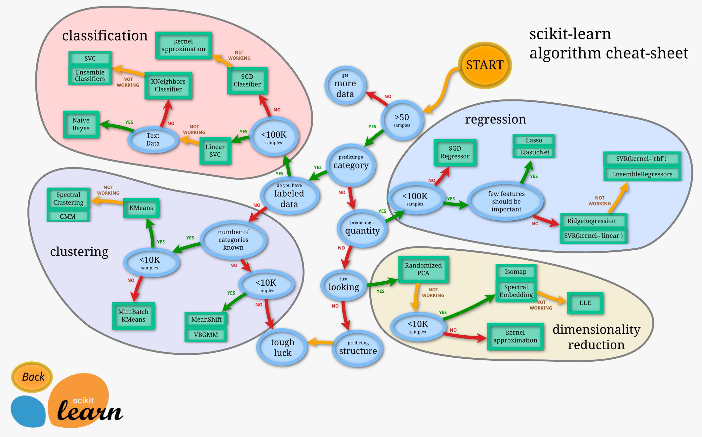

# 特征提取

特征提取，也被称为特征抽取或特征提取器，是一种降低数据维度或重新组合原始特征的技术，以便于后续的使用。

## 特征提取与特征选择的区别

特征提取是在原有特征的基础上进行创新和重组，产生新的特征集；特征选择则是在原有特征集中挑选出最具代表性或最有预测能力的特征。

两者都是为了提高模型的准确性和泛化能力，但实现方式和侧重点不同。

!!! tip "共同点"

    特征选择 (feature selection) 和特征提取 (feature extraction) 都属于降维(Dimension reduction)，但是特征选择重点在于从已有的特征集中挑选出最具代表性的特征，而特征提取则重点在于从原始数据中提取出新的特征。

## 特征提取的目的

主要目的是**减少数据维度和整理已有的数据特征**，从而改善模型的性能并减少计算的复杂性。

## 特征提取的主要方法

传统图像特征提取方法和深度学习方法，一种是基于图像本身的特征，另一种是基于样本自动训练出区分图像的特征分类器

1. 传统的特征提取方法：基于图像本身的特征进行提取

2. 深度学习方法：基于样本自动训练出区分图像的特征分类器

常用的特征提取方法有很多，如主成分分析（PCA），独立成分分析（ICA），线性判别分析（LDA）等。其中，PCA 可以将 n 维特征映射到 k 维上，这 k 维是全新的正交特征。此外，对于带有类别标签的数据，一般可以考虑使用 LDA 降维。而在计算机视觉领域，一些传统的特征提取方法，如 SIFT (尺度不变特征变换)、HOG (方向梯度直方图)、SURF、ORB、LBP、HAAR 等也常被广泛应用。

### PCA(Principal Component Analysis)

#### 基本思想

主成分分析是一种使用最广泛的数据降维算法。它能够将多个变量映射为少数几个主成分（即低维），同时可以保证降维后的数据保持原有的最大信息量。

!!! note "PCA 算法优化目标"

    1. 降维后同维度的方差最大
    2. 不同维度间相关性为0

#### 基本原理

主成分分析的基本思想是将 n 维特征映射到 k 维上，这 k 维是全新的正交特征。在实际应用中，通常用特征值和特征向量表示。

简单说，就是

1. 找到方差[^1]最大的 k 个方向
2. 找到方差最大的 k 个方向对应的特征值
3. 选择前 k 个特征值所对应的 k 个方向作为主成分

!!! note "PCA 降维的几何意义"

    PCA 降维的几何意义是，通过正交变换将原始数据变换为一组各维度线性无关的表示，在此过程中，原始数据的信息被最大程度的保留，同时消除了原始数据中存在的大量冗余信息。

    对于一组数据，如果它在某坐标轴上的方差越大，说明坐标点越分散，则此属性能够很好的代表原数据；反之，如果它在某坐标轴上的方差越小，说明坐标点越密集，则此属性能够代表的信息量越小。

#### 算法步骤

1. 对原始数据进行零均值化[^2]（中心化）：这是通过将每一维的数据减去该维的均值来实现的。
2. 计算数据的协方差[^3]矩阵[^4]：这一步是为了了解数据中各个维度之间的相关性。
3. 对协方差矩阵进行特征值分解，得到特征值和特征向量：这一步是寻找能够最大程度上解释数据变异性的方向。
4. 选取前 k 个最大的特征值对应的特征向量，构成新的矩阵：这些特征向量就是新的维度，它们是在保留原数据集最大信息的同时，实现了维度的降低。
5. 将原始数据投影到新的矩阵上，得到降维后的数据：这一步是通过将原始数据按照新的特征向量进行线性组合来实现的。

=== "<1>"

    

=== "<2>"

    

=== "<3>"

    

=== "<4>"

    

=== "<5>"

    

!!! quote "对协方差矩阵求特征值与特征矩阵"

    [对协方差矩阵求特征值与特征矩阵](../chapter03_math_basic/matrix.md###特征值与特征向量计算)

!!! note "对特征值进行排序"

    1. 将特征值按照从大到小的排序，选择其中最大的 k 个，然后将其对应的 k 个特征向量分别作为列向量组成特征向量矩阵$W_nX_k$。
    2. 计算$X_{new}W$，即为将数据集X投影到选择的特征向量上，这样就得到了我们所需的已经降维的数据集$X_{new}W$。

!!! note "评价模型的好坏，k 值的确定"

    通过特征值的计算，我们可以得到主成分所占的百分比，用来衡量模型的好坏。

    对于前k个特征值所保留下的信息量计算方法如下：

    $$
    \eta _k = \frac{\sum_{i=1}^k \lambda _i} {\sum_{i=1}^n \lambda _i}
    $$

!!! note "sklearn"

    

    Scikit-learn，也被称为sklearn，是一个开源的基于Python的机器学习工具包。这个库实现了高效的算法应用，同时涵盖了几乎所有主流机器学习算法。此外，Scikit-learn还包含了许多常用的预处理技术、模型选择和评估工具等，包括但不限于分类、回归和聚类算法。例如，它支持向量机，随机森林，梯度提升，k均值和DBSCAN等多种机器学习方法。总的来说，Scikit-learn为数据挖掘和数据分析提供了非常便利的工具。

#### PCA 算法优缺点

优点:

1. 完全无参数限制的。在 PCA 的计算过程中完全不需要人为的设定参数或是根据任何经验模型对计算 进行干预，最后的结果只与数据相关，与用户是独立的。
2. 用 PCA 技术可以对数据进行降维，同时对新求出的“主元”向量的重要性进行排序，根据需要取前面 最重要的部分，将后面的维数省去，可以达到降维从而简化模型或是对数据进行压缩的效果。同时 最大程度的保持了原有数据的信息。
3. 计算方法简单，易于在计算机上实现。

缺点:

1. 如果用户对观测对象有一定的先验知识，掌握了数据的一些特征，却无法通过参数化等方法对处理 过程进行干预，可能会得不到预期的效果，效率也不高。

#### 代码实现

=== "python"

    ```python
    import numpy as np

    def pca(X, n_components=2):
        # 1. 计算均值并进行中心化
        X_mean = np.mean(X, axis=0)
        X_centered = X - X_mean

        # 2. 计算协方差矩阵
        cov_matrix = np.cov(X_centered, rowvar=False)

        # 3. 计算特征值和特征向量
        eigenvalues, eigenvectors = np.linalg.eig(cov_matrix)

        # 4. 对特征值进行排序，并获取排序后的索引
        sorted_indices = np.argsort(eigenvalues)[::-1]

        # 5. 选择前n_components个特征向量
        top_n_eigenvectors = eigenvectors[:, sorted_indices[:n_components]]

        # 6. 将数据投影到选定的特征向量上
        X_pca = np.dot(X_centered, top_n_eigenvectors)

        return X_pca

    # 示例
    X = np.array([[1, 2], [3, 4], [5, 6]])
    X_pca = pca(X, n_components=1)
    print(X_pca)

    ```

=== "C++"

    ```cpp
    // 🈚️
    ```

### 线性判别分析 LDA(Linear Discriminant Analysis)

#### 基本思想

线性判别分析是一种监督学习算法，它将高维的输入数据投影到另一个低维空间，并希望投影后各个类别的数据在这个低维空间中的距离尽可能分开。

#### 基本原理

线性判别分析的基本思想是找到一个超平面将不同类别数据在超平面两端分开，这样不同类别的数据点就不会被混在一起了。

LDA 通过计算类内散度和类间散度，找到一个最优的投影方向，使得投影后的数据在新的坐标系下能够更好地区分不同的类别。

简单说，就是

1. 找到方差[^2]最大的方向
2. 找到方差最大的方向对应的特征值
3. 选择方差最大的方向作为超平面

#### 算法步骤

1. 计算类内散度矩阵 Sw 和类间散度矩阵 Sb。
2. 求解 Sw 和 Sb 的特征值和特征向量。
3. 选择最大的 k 个特征值对应的特征向量，构成投影矩阵 W。
4. 将原始数据投影到新的坐标系上，得到降维后的数据。

#### 代码实现

=== "python"

        ```python
        import numpy as np
        from sklearn.discriminant_analysis import LinearDiscriminantAnalysis as LDA

        # 假设有4个样本，每个样本有2个特征
        X = np.array([[-1, -1], [-2, -1], [-3, -2], [1, 1], [2, 1], [3, 2]])
        y = np.array([1, 1, 1, 2, 2, 2])

        # 创建LDA模型
        lda = LDA(n_components=1)

        # 对数据进行拟合和转换
        X_new = lda.fit_transform(X, y)

        print("降维后的数据：
        ", X_new)
        ```

=== "C++"

    ```cpp
    ```

[^1]: 方差

    定义：方差是用来衡量一组数据的离散程度的统计量，也就是说，它用来衡量每个变量（观察值）与总体均数之间的差异。方差越小，代表这组数据越稳定；方差越大，代表这组数据越不稳定。

    公式：$s^2=\frac{\sum_{i=1}^n(x_i- \bar{x})^2}{n-1}$

[^2]: 零均值化

    即减去均值，使每个特征的均值为 0，即每个特征的均值为 0，即每个特征的方差为 1。

[^3]: 协方差

    定义：是一种用来度量两个随机变量关系的统计量。同一元素的协方差就表示该元素的方差，不同元素之间的协方差就表示它们的相关性。

    公式：$cov(X,Y)=E[(X-\mu_x)(Y-\mu_y)]

    性质：

    1. $cov(X,Y)=cov(Y,X)$
    2. $cov(aX,bY)=abcov(X,Y)$, a，b 为常数
    3. $cov(x_1+x_2,Y)=cov(x_1,Y)+cov(x_2,Y)$

    协方差与两属性间关系：

    1. 当$cov(X,Y)=0$时，X 与 Y 不相关
    2. 当$cov(X,Y)>0$时，X 与 Y 正相关
    3. 当$cov(X,Y)<0$时，X 与 Y 负相关

[^4]: 协方差矩阵

    定义：协方差矩阵是用来度量各个维度之间的相关性的统计量。

    公式：$C_{i,j}=cov(X_i,X_j)$

    性质：

    1. $C_{i,j}=C_{j,i}$
    2. $C_{i,i}=E[(X_i-\mu_i)^2]$

    特点：

    1. 协方差矩阵计算的是不通维度之间的协方差，而不是不同样本间的协方差
    2. 样本矩阵的每行是一个样本，每列是一个维度，故按列计算均值
    3. 协方差矩阵的对角线是各个维度的方差
    4. 特别的，如果做了中心化，则协方差矩阵为$D=\frac{1}{m}Z^TZ$（中心化矩阵的协方差矩阵公式，m 为样本数量）
