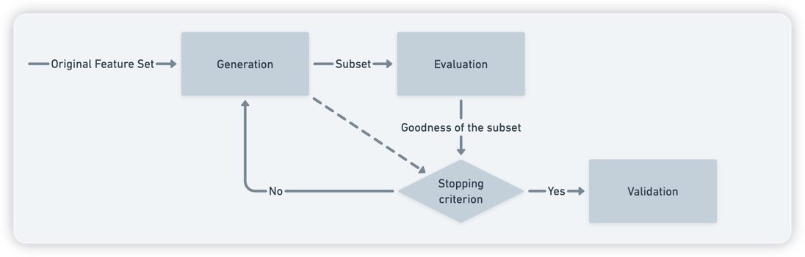
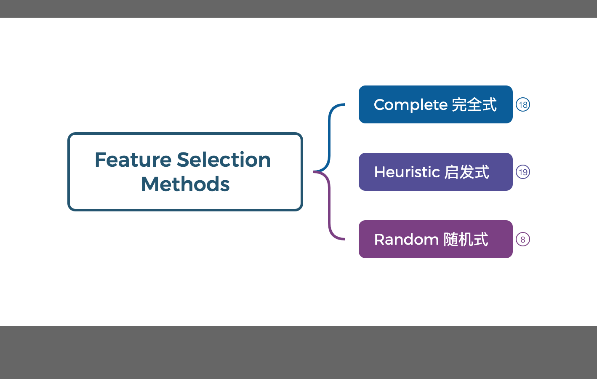
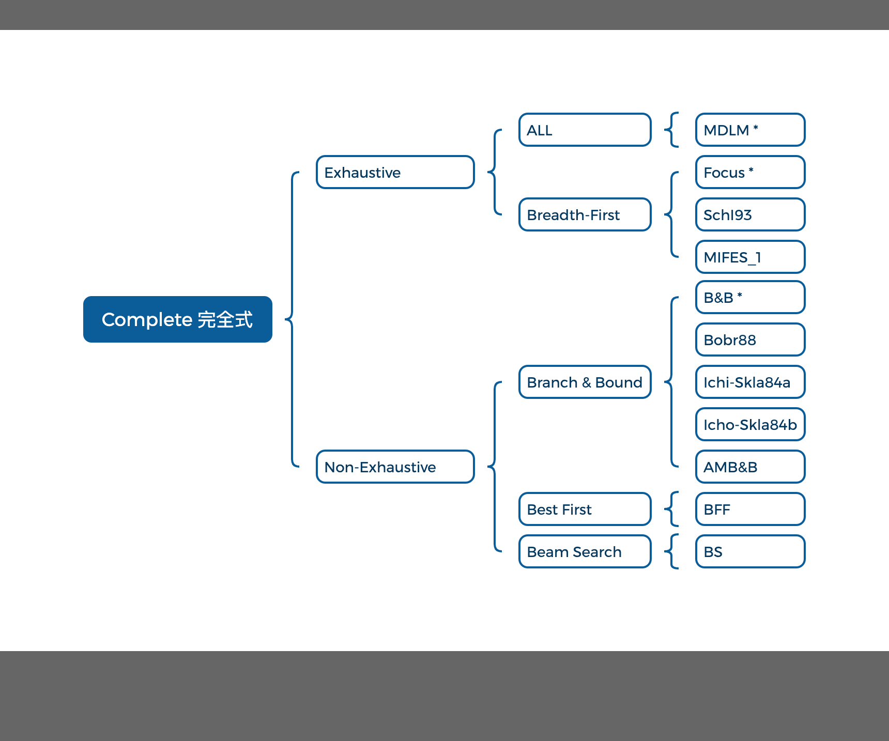
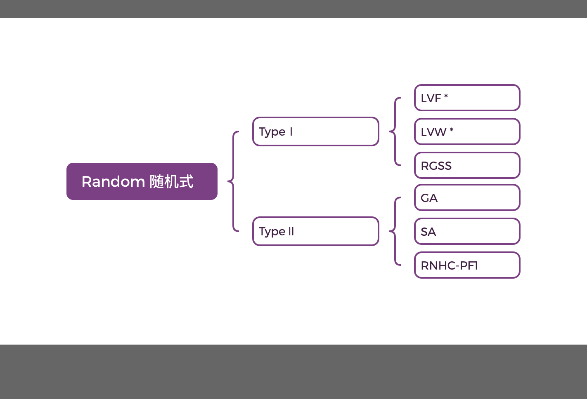
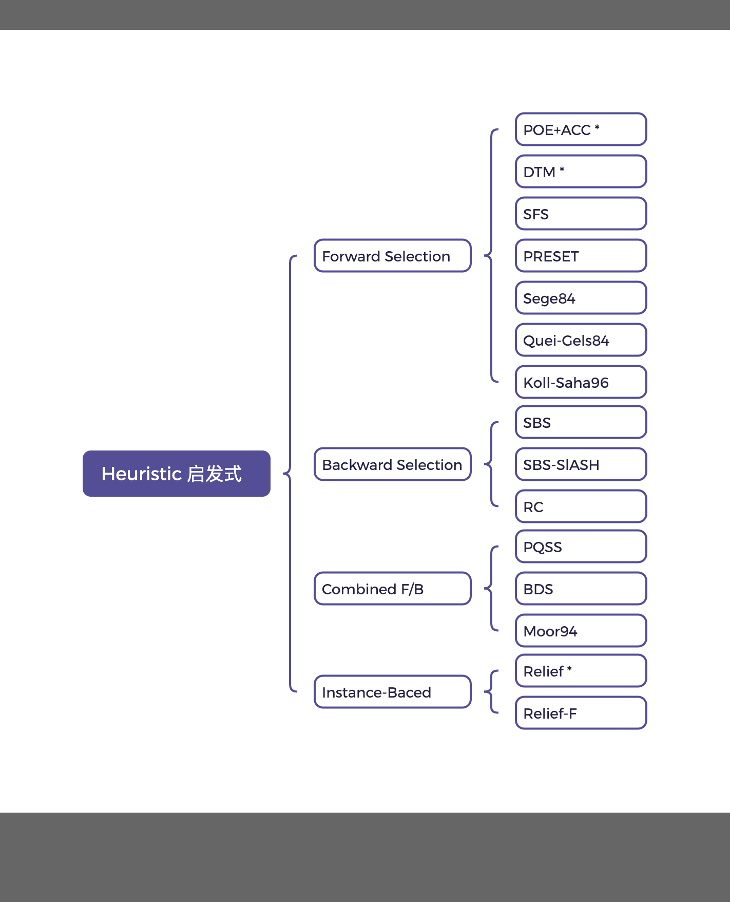

# 特征选择

!!! note "特征"

    在现实生活中，一个对象往往具有很多属性，这些属性被称为特征。在机器学习中，特征是描述数据的重要属性，也是影响模型预测结果的关键因素。

    在一些实际问题中，我们得到的样本数据都是多个维度的，即一个样本是用多个特征来表征的。比如在预测房价的问题中，影响房价 y
    的因素有房子面积 x1、卧室数量 x2 等，我们得到的样本数据就是(x1,x2)这样一些样本点，这里的 x1、x2 又被称为特征。

    在现实生活中，一个对象往往具有很多属性(以下称为特征)，这些特征大致可以被分成三种主要的类型:

    - 相关特征:对于学习任务(例如分类问题)有帮助，可以提升学习算法的效果;
    - 无关特征:对于我们的算法没有任何帮助，不会给算法的效果带来任何提升;
    - 冗余特征:不会对我们的算法带来新的信息，或者这种特征的信息可以由其他的特征推断出。

    但是对于一个特定的学习算法来说，特征是否有效是未知的；因此，需要从所有特征中选择出对学习算法有益的相关特征。

在机器学习算法中，特征选择(feature selection)是决定性的，它将决定其他算法的结果。

特征选择是一个迭代过程，每次迭代都会删除一些特征，然后用训练集训练一个模型，并使用模型对验证集进行评估，如果模型效果不好，则将模型在训练集上的效果评估作为下一个迭代的依据。

## 目的

1. 对于特定的学习算法来说，特征有效性是未知的。因此，需要从所有特征中选择出对于学习算法有益的相关特征。
2. 随着所需处理的数据越来越大，样本的特征数呈现直线性的增长。

特征选择作为一种数据预处理策略，目标是**构建更简单、更易于理解的模型、提高数据挖掘性能以及数据降维。**

## 定义

> 特征选择(feature selection)指的是从所有特征中挑选出一些特征子集，然后用子集来学习模型。

从 N 个特征中选择$M$($M \lt N$)个子特征，并且在 M 个子特征中，准则函数可以达到最优解。

### 准则函数

准则函数是在特征选择过程中，用于评估每个特征或特征子集对于学习任务的重要程度的一种方法。它的目标是找到一种方式来**最大化或最小化某个指标**，_例如模型的准确性或者误差的平方和等。_

这个函数通常会根据**所选用的特征选择算法和学习任务的性质**来定制，常见的准则函数有信息增益、卡方检验、相关系数等。例如，在监督学习中，我们可能会使用如准确率、召回率等指标作为准则函数；而在无监督学习中，我们可能会考虑如类内散布度、类间散布度等指标。

需要注意的是，虽然准则函数在特征选择中起着关键的作用，但它也可能带来过拟合的问题。因此，在选择准则函数时，我们需要综合考虑模型的复杂度和泛化能力。

### 降维

> 降维可以降低特征向量维度，这主要是因为特征向量往往包含冗余信息，有些特征可能与分类问题无关，特征之间存在较强的相关性。通过保留一些比较重要的特征，去除一些冗余的特征，可以减少数据特征的维度。
>
> 降维技术主要分为两大类：特征选择和特征提取。特征选择指的是从原始特征中选出一个子集，而特征提取则是通过现有信息进行推演，构造出一个新的特征子空间。无论是哪种方式，其目的都是为了提高模型的性能和效率。

#### 为什么需要降维

在原始的高维空间中，包含冗余信息和噪声信息，这会在实际应用中引入误差，影响预测准确率。而通过降维，可以提取数据内部的本质结构，减少冗余信息和噪声信息造成的误差，从而提高应用中的精度。例如，PCA 降维算法的核心思想是将高维数据投影到低维空间上，投影后的数据尽可能保持原始数据的特征。

综上，特征选择和数据降维都能够实现减少特征数量、提高模型精确度和运行效率的目标，同时还能降低噪声影响，提升模型的泛化能力。

## 选择准则

特征选择的目标是选择出对模型训练有用的特征，特征选择的标准主要有两个:

1. 选择尽量少的特征，使得模型训练效果不受影响;
2. 选择后的类别分布尽可能接近真实的类别分布。

## 基本步骤

包括四个基本过程：

1. 生成子集：

   这是搜索特征子集的过程，为评价函数提供特征子集。这一步可能会产生一个候选特征集合，包含所有可能的特征组合或单个特征。

2. 评价函数：

   这一步衡量特征或特征子集的重要性或者好坏程度，即量化特征变量和目标变量之间的联系以及特征之间的相互关系。评价函数可以是信息增益、卡方检验、相关系数等。为了避免过拟合，可以使用交叉验证的方式来评估特征的好坏。

3. 停止准则：

   与评价函数相关，一般是设定一个阈值，当评价函数达到一定标准后就可以停止搜索。例如，如果通过评价函数计算出的得分达到了预定阈值，那么搜索就可以停止。

4. 验证过程：

   在验证数据集上验证选出来的特征子集的有效性。这一步是为了保证所选择的特征子集能够在未知数据上取得良好的预测效果。

### 生成子集（搜索过程）

特征选择的搜索过程主要有三种策略：全局最优、随机搜索和启发式搜索。

=== "all"

    

=== "complete"

    

=== "random"

    

=== "heuristic"

    

1. 全局最优策略：

   这种策略会搜索所有可能的特征子集，并从中选择出最好的一个。这种策略的特点是能找出最优解，但计算复杂度高，尤其是当特征数量较多时，其计算量呈指数级增长，因此在实际应用中较少使用。完全搜索又可以分为穷举搜索和非穷举搜索，如广度优先搜索就是穷举搜索的一种。

2. 随机搜索策略：

   这种策略在每次迭代中都会随机选择一个特征子集，然后评估其性能。随机搜索的优点是计算量较小，可以在合理的时间内得到较好的解决方案。但由于其随机性，可能会陷入局部最优解，因此需要通过多次运行来提高结果的稳定性。

3. 启发式搜索策略：

   这种策略会根据一定的规则或者经验来指导搜索过程，从而减少搜索空间，提高搜索效率。例如遗传算法就是一种随机搜索算法，同时也是一种启发式搜索算法。

以上三种策略各有优缺点，需要根据实际问题和数据集的特性来选择合适的特征选择策略。例如，如果数据集的特征数量较少且所有特征都对模型训练有帮助，那么可以考虑使用全局最优策略；如果数据集的特征数量较多或者某些特征对模型训练帮助不大，那么可以考虑使用随机搜索或启发式搜索策略。

#### 扩展

##### 完全搜索

- 广度优先搜索(Breadth First Search):

  使用广度优先算法遍历所有可能的特征子集，选择出最优的特征子集。

- 分支界限搜索(branch and bound search):

  B&B 从所有的特征上开始搜索，每次迭代从中去掉一个特征，每次给评价函数的值一个限制条件。因为评价函数满足单调性原理(一个特征子集不会好于所有包含这个特征子集的更大的特征子集)，所以如果一个特征使得评价函数的值小于这个限制，那么就删除这个特征。类似于在穷举搜索中进行剪枝。

- 定向搜索(Beam Search):

  主要采用完全搜索策略和误分类率作为评价函数。选择**得分最高**的特征作为特征子集，把它加入到一个有长度限制的队列中，从头到尾依次是性能最优到最差的特征子集。每次从队列总取得分最高的子集，然后穷举向该子集中加入一个特征后所有的特征集，按照得分把这些子集加入到队列中。

- 最优优先搜索(Best First Search):

  和定位搜索类似，不同点在于不限制队列的长度。

##### 启发式搜索

- 序列前向选择(SFS , Sequential Forward Selection):

  使用**误分类率**作为评价函数。从空集开始搜索， 每次把一个特征加入到这个特征子集中，使得评价函数达到最优值。如果候选的特征子集不如上一轮的特征子集，那么停止迭代，并将上一轮的特征子集作为最优的特征选择结果。

- 广义序列前向选择(GSFS ，Generalized Sequential Forward Selection):

  该方法是 SFS 算法的加速算 法，它可以一次性向特征集合中加入 r 个特征。在候选特征中选择一个规模为 r 的特征子集，使得评价函数取得最优值。

- 序列后向选择(SBS , Sequential Backward Selection):

  把误分类率作为评价函数。从特征的全集开始搜索，每次从特征子集中去掉一个特征，使得评价函数达到最优值。

- 广义序列后向选择(GSBS，Generalized Sequential Backward Selection):

  该方法是 SBS 的加速，可以一次性的从特征子集中去除一定数量的特征。是实际应用中的快速特征选择算法，性能相对较好。但是有可能消除操作太快，去除掉重要的信息，导致很难找到最优特征子集。

- 双向搜索(BDS , Bi-directional Search):

  分别使用 SFS 和 SBS 同时进行搜索，只有当两者达到一个相同的特征子集时才停止搜索。为了保证能够达到一个相同的特征子集，需要满足两个条件:

  - 被 SFS 选中的特征不能被 SBS 去除;
  - 被 SBS 去除的特征就不能 SFS 选择;

- 增 L 去 R 选择算法(LRS , Plus L Minus R Selection):

  采用误分类率作为评价函数。允许特征选择的过程中进行回溯，这种算法主要有两种形式:

  - 当 L > R 时，是一种自下而上的方法，从空集开始搜索，每次使用 SFS 增加 L 个特征，然后用 SBS 从中去掉 R 个特征;
  - 当 L < R 时，是一种自上而下的算法，从特征的全集开始搜索，每次使用 SBS 去除其中的 R 个特征，使用 SFS 增加 L 个特征;

- 序列浮动选择(Sequential Floating Selection):
  和增 L 去 R 算法类似，只不过序列浮动算法的 L 和 R 不是固定的，每次会产生变化，这种算法有两种形式:

  - 序列浮动前向选择(SFFS , Sequential Floating Forward Selection):

    从空集开始搜索，每次选择 一个特征子集，使得评价函数可以达到最优，然后在选择一个特征子集的子集，把它去掉使得评 价函数达到最优;

  - 序列浮动后向选择(SFBS , Sequential Floating Backward Selection:

    从特征全集开始搜索，每次 先去除一个子集，然后在加入一个特征子集。

- 决策树算法(DTM , Decision Tree Method):

  采用信息增益作为评价函数。在训练集中使用 C4.5 算法，等到决策树充分增长，利用评价函数对决策树进行剪枝。最后，出现在任意一个叶子节点的路径上的所有特征子集的并集就是特征选择的结果。

##### 随机搜索

LVF(Las Vegas Filter):使用一致性度量作为评价函数。使用拉斯维加斯算法随机搜索子集空间，这样可以很快达到最优解。对于每一个候选子集，计算它的不一致性，如果大于阈值，则去除这个子集。否则，如果这个候选子集中的特征数量小于之前最优子集的数量，则该子集作为最优子集。这个方法在有噪声的数据集达到最优解，它是很简单被实现而且保证产生比较好的特征子集。但是在一些特定问题上，它会花费比启发式搜索更多的时间，因为它没有利用到先验知识。

##### 遗传算法

使用误分类率作为评价函数。随机产生一批特征子集，然后使用评价函数对于子集进行评分，通过选择、交叉、突变操作产生下一代特征子集，并且得分越高的子集被选中产生下一代的几率越高。经过 N 代迭代之后，种群中就会形成评价函数值最高的特征子集。它比较依赖于随机性，因为选择、交叉、突变都由一定的几率控制，所以很难复现结果。遗传算法的过程如下:

1. 随机产生初始种群;
2. 在非支配排序后，通过遗传算法的三个算子(选择算子，交叉算子，变异算子)进行变更操作得到第一代种群;
3. 将父代种群与子代种群合并得到大小为 N 的初始化种群;
4. 对包括 N 个个体的种群进行快速非支配排序;
5. 对每个非支配层中的个体进行拥挤度计算;
6. 根据非支配关系及个体的拥挤度选取合适的个体组成新的父代种群;
7. 通过遗传算法的基本变更操作产生新的子代种群;
8. 重复 3 到 7 直到满足程序结束的条件(即遗传进化代数);

### 评价函数

用来评价选出的特征子集好坏的标准，通常需要根据具体问题来选择。例如，如果需要选择一个特征子集来最小化模型预测误差，那么可以使用均方误差(MSE)作为评价函数；如果需要选择一个特征子集来最大化模型的预测精度，那么可以使用交叉验证来评估特征子集的好坏。

#### 评价函数的分类

特征子集的优劣往往由评价函数来衡量，评价函数主要用来度量特征或特征子集可以区分不同类别的能力。根据具体的评价方法主要有三类：

1. 过滤式(filter):

   先进行特征选择，然后去训练学习器，所以特征选择的过程与学习器无关。相当于先对于特征进行过滤操作，然后用特征子集来训练分类器。对每一维的特征“打分”，即给每一维的特征赋予权重，这样的权重就代表着该维特征的重要性，然后依据权重排序。

2. 包裹式(wrapper):

   直接把最后要使用的分类器作为特征选择的评价函数，对于特定的分类器选择最优的特征子集。将子集的选择看作是一个搜索寻优问题，生成不同的组合，对组合进行评价，再与其他的组合进行比较。这样就将子集的选择看作是一个优化问题

3. 嵌入式(embedding):

   把特征选择的过程与分类器学习的过程融合一起，在学习的过程中进行特征选择。

   其主要思想是:在模型既定的情况下学习出对提高模型准确性最好的属性。（这句话并不是很好理解，其实是讲在确定模型的过程中，挑选出那些对模型的训练有重要意义的属性）

衍生的方法类型：

- Filter 和 Wrapper 组合式算法:

  先使用 Filter 进行特征选择，去掉不相关的特征，降低特征维度；然后利用 Wrapper 进行特征选择。

#### 常见评价函数

##### 距离度量

> 如果 X 在不同类别中能产生比 Y 大的差异，那么就说明 X 要好于 Y;

主要用于衡量两个实例之间的相似度或差异度。例如，欧氏距离、曼哈顿距离等都是常用的距离度量方法。

##### 信息度量

> 计算一个特征的信息增益(度量先验不确定性和期望, 后验不确定性之间的差异)

主要用于量化信息的不确定性或者确定性。香农熵、互信息等是常见的信息度量方法。

##### 依赖度量

> 主要用来度量从一个变量的值预测另一个变量值的能力。最常见的是相关系数:用来发现一个特征和一个类别的相关性。如果 X 和类别的相关性高于 Y 与类别的相关性，那么 X 优于 Y。对相关系数做一点改变，用来计算两个特征之间的依赖性，值代表着两个特征之间的冗余度。

主要用于衡量两个实例之间的依赖关系。点互信息、最大公共子序列等都可以作为依赖度量的指标。

##### 一致性度量

> 对于两个样本，如果它们的类别不同，但是特征值是相同的，那么它们是不一致的;否则是一致的。找到与全集具有同样区分能力的最小子集。严重依赖于特定的 训练集和最小特征偏见(Min-Feature bias)的用法;找到满足可接受的不一致率(用户指定的参数)的最小规模的特征子集。

主要用于衡量预测结果和真实结果之间的一致性。均方误差（Mean Squared Error-MSE）是一种常见的一致性度量方法，它计算的是预测值与真实值之间距离的平方和。

##### 误分类度量

> 主要用于 Wrapper 式的评价方法中。使用特定的分类器，利用选择的特征子集来预测测试集的类别，用分类器的准确率来作为指标。这种方法准确率很高，但是计算开销较大。

主要用于评估分类模型的性能，如准确率、召回率等都是误分类度量的常用指标。

### 停止准则

> 停止准则用于确定特征选择过程何时停止。

停止条件有四种选择：

1. 达到预定义的最大迭代次数
2. 达到预定义的最大特征数量
3. 增加（或删除）任何特征都不会对评估结果产生影响
4. 根据评价函数，产生一个最优特征子集
