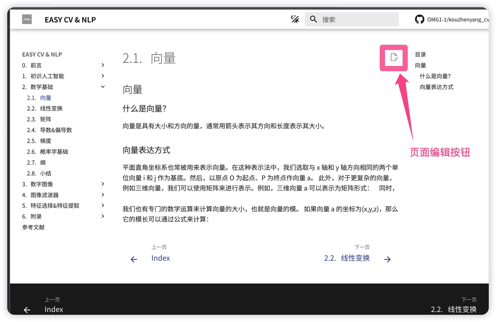

# 一起参与创作

!!! success "开源的魅力"

    纸质书籍的两次印刷的间隔时间往往需要数年，内容更新非常不方便。</br>但在本开源书中，内容更迭的时间被缩短至数日甚至几个小时。

由于作者能力有限，书中难免存在一些遗漏和错误，请您谅解。如果您发现了笔误、失效链接、内容缺失、文字歧义、解释不清晰或行文结构不合理等问题，请协助我们进行修正，以帮助其他读者获得更优质的学习资源。所有[撰稿人](https://github.com/krahets/hello-algo/graphs/contributors)将在仓库和网站主页上展示，以感谢他们对开源社区的无私奉献！

## 内容微调

在每个页面的右上角有一个「编辑」图标，您可以按照以下步骤修改文本或代码：

1. 点击编辑按钮，如果遇到“需要 Fork 此仓库”的提示，请同意该操作。
2. 修改 Markdown 源文件内容，并确保内容正确，同时尽量保持排版格式的统一。
3. 在页面底部填写修改说明，然后点击“Propose file change”按钮；页面跳转后，点击“Create pull request”按钮即可发起拉取请求。



由于图片无法直接修改，因此需要通过新建 [Issue](https://github.com/krahets/hello-algo/issues) 或评论留言来描述问题，我们会尽快重新绘制并替换图片。

## 内容创作

如果您有兴趣参与此开源项目，包括将代码翻译成其他编程语言、扩展文章内容等，那么需要实施 Pull Request 工作流程：

1. 登录 GitHub ，将[本仓库](https://github.com/krahets/hello-algo) Fork 到个人账号下。
2. 进入您的 Fork 仓库网页，使用 git clone 命令将仓库克隆至本地。
3. 在本地进行内容创作，并通过运行测试以验证代码的正确性。
4. 将本地所做更改 Commit ，然后 Push 至远程仓库。
5. 刷新仓库网页，点击“Create pull request”按钮即可发起拉取请求。

## Docker 部署

执行以下 Docker 脚本，稍等片刻，即可在网页 `http://localhost:8000` 访问本项目。

```shell
git clone https://github.com/krahets/hello-algo.git
cd hello-algo
docker-compose up -d
```

使用以下命令即可删除部署。

```shell
docker-compose down
```
